***

# Observability Deep Dive

## 1. Observability Fundamentals

Observability is basically the ability to figure out and react to the internal state of an IT system or application. Similar to monitoring, observability heavily relies on outputs, logs, and performance metrics. However, compared to just standard monitoring, observability helps organizations proactively use those metrics to troubleshoot and tune up their systems. For instance, by keeping an eye on system events, various automation tools can respond to issues right as they happen, which helps keep systems running smoothly.

### 1.1 The Three Pillars of Observability

The entire foundation of modern observability setups pretty much relies on three main types of data: **Metrics**, **Logs**, and **Traces**.

#### Metrics
* **What it is:** This is mostly quantitative data that gets measured over specific time intervals. Metrics are basically aggregated summaries of the system's state (things like CPU utilization, request rates, or error counts).
* **Data it contains:** Usually a timestamp, a numeric value, the name of the metric, and a set of key-value pairs (often called labels or tags) that add some dimensions to the data.
* **When to use:** These are typically used for high-level dashboards, analyzing long-term trends, and setting up automated alerts.
* **Problems solved:** It answers the question, "Is there a problem happening right now?" Since metrics are very efficient to store and query, they make the perfect trigger for paging an engineer when something looks off.

#### Logs
* **What it is:** These are immutable, timestamped records of specific events that happened over time inside a system.
* **Data it contains:** A timestamp along with a payload (which can be plain text or structured data like JSON) that describes the event. It usually also includes some metadata like the severity level or the service name.
* **When to use:** Logs are mainly used for deep-dive debugging, forensic analysis, and auditing purposes.
* **Problems solved:** It answers, "What exactly happened here?" Logs provide the really fine-grained context that is usually needed to track down the root cause of an error.

#### Traces
* **What it is:** This is a representation of a chain of causally related events across a distributed system. It essentially tracks the end-to-end flow of a single request.
* **Data it contains:** It consists of a collection of "Spans", which are all linked together by a unique Trace ID.
* **When to use:** Traces are super helpful for understanding system topologies, finding performance bottlenecks, and mapping out how different microservices depend on each other.
* **Problems solved:** It answers, "Where exactly did the problem happen, and how long did each specific step take?"

### 1.2 How They Complement Each Other (The Investigation Workflow)

The real value of observability comes from correlating these three pillars together. They aren't meant to be isolated tools; instead, they act sort of like a funnel for incident response:

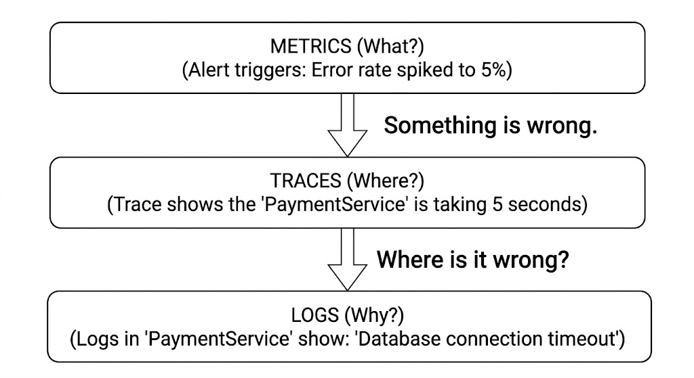

### 1.3 Data Types and Formats

#### Metrics Data Types
Modern Time Series Databases (TSDBs) like Prometheus tend to use four core metric types:

* **Counters:** Counters basically provide a metric as a simple number. It just gives the exact running count of some metric data.
  * *Example:* The total number of HTTP 500 errors or the total number of requests hitting an API.
* **Gauges:** Gauges give a representation of metric data that can go up or down. These are mostly used for metrics where the value has a known current state.
  * *Example:* CPU usage percentage or the current amount of memory being used.
* **Histograms:** This provides a different way to look at metric data. The data is usually grouped into configurable buckets based on sample observations over a duration of time. It also keeps a sum of all the observed values.
  * *Example:* Measuring API response times and tossing them into buckets (like `< 0.1s`, `< 0.5s`, `< 1s`).
* **Summaries:** These just provide a summarized or general idea about the overall state of a system.
  * *Example:* Server health being GOOD/BAD, or RAM usage being HIGH/MEDIUM/LOW.

#### Logs: Structured vs. Unstructured
* **Unstructured Logs:** These are usually just plain text strings meant for humans to read. They are easy enough for a person to understand, but they often require heavy use of regular expressions (regex) to parse the data out. That makes them pretty slow and computationally expensive to query at scale, especially since they lack a standardized format.
  * *Example:*
    ```text
    2026-03-30 10:15:30 ERROR [CheckoutService] User 98765 payment failed.
    ```
* **Structured Logs:** These are log entries formatted as standardized data objects, like XML or JSON. Because they have a structure, centralized logging systems (like Elasticsearch or Splunk) can natively index the fields, which allows for really fast, SQL-like querying.
  * *Example:*
    ```json
    {
        "timestamp": "2026-03-30T10:15:30.123Z",
        "level": "ERROR",
        "service": "checkout-service",
        "trace_id": "4bf92f3577b34da6a3ce929d0e0e4736",
        "message": "Payment failed due to timeout",
        "user_id": "98765",
        "response_time_ms": 5004
    }
    ```

#### Traces: Core Concepts
* **Spans:** This is the basic building block of a trace. A span just represents a single unit of work (like a database query or an HTTP request).
  * *Example:*
    ```json
    {
        "traceId": "4bf92f3577b34da6a3ce929d0e0e4736",
        "spanId": "a2fb4a8c11e7a001",
        "parentSpanId": "00f067aa0ba902b7",
        "name": "SELECT user_profiles",
        "startTime": 1711815330123000,
        "endTime": 1711815330183000,
        "attributes": {
            "db.system": "postgresql",
            "db.statement": "SELECT * FROM users WHERE id = ?"
        }
    }
    ```
* **Trace Context:** This is the combination of the `traceId` and `spanId`. It has to be passed across network boundaries (usually by using HTTP headers like `traceparent`) so that the downstream services know they are part of the exact same transaction.
* **Baggage:** These are arbitrary key-value pairs (for example, `tenant_id=premium_user`) that get injected into the trace context and travel right alongside the request. It lets downstream services read business context without needing to make extra database lookups.
Here is the fully expanded section for **1.4 Common Protocols**. The descriptions for Prometheus, StatsD, Syslog, and Jaeger Thrift have been fleshed out with actual data format examples and simple, conversational explanations, completely matching the depth of the OTLP section. 

You can copy and paste this directly over your current 1.4 section:

***

### 1.4 Common Protocols

* **OTLP (OpenTelemetry Protocol):** This is pretty much becoming the modern, vendor-agnostic standard for sending telemetry data (Metrics, Logs, and Traces). It uses Protocol Buffers (protobuf) over gRPC or HTTP, and it's quickly replacing older proprietary protocols.
  The OpenTelemetry Protocol (OTLP) defines the rules, conventions, and standards for how OpenTelemetry components exchange data between a client and a server. It is part of the OpenTelemetry project and works over gRPC and HTTP 1.1.
  * **Traces** describe how services execute:
    ```protobuf
    message Span {
        bytes trace_id = 1;
        bytes span_id = 2;
        string trace_state = 3;
        bytes parent_span_id = 4;
        fixed32 flags = 16;
        string name = 5;
        enum SpanKind {...}
        SpanKind kind = 6;
        fixed64 start_time_unix_nano = 7;
        fixed64 end_time_unix_nano = 8;
        repeated opentelemetry.proto.common.v1.KeyValue attributes = 9;
        uint32 dropped_attributes_count = 10;
        message Event {...}
        repeated Event events = 11;
        uint32 dropped_events_count = 12;
        message Link {...}
        repeated Link links = 13;
        uint32 dropped_links_count = 14;
        Status status = 15;
    }
    ```
  * **Metrics** carry numerical and statistical info:
    ```protobuf
    message Metric {
        string name = 1;
        string description = 2;
        string unit = 3;
        oneof data {
            Gauge gauge = 5;
            Sum sum = 7;
            Histogram histogram = 9;
            ExponentialHistogram exponential_histogram = 10;
            Summary summary = 11;
        }
        repeated opentelemetry.proto.common.v1.KeyValue metadata = 12;
    }
    ```
  * **Logs** carry detailed state info:
    ```protobuf
    message LogRecord {
        reserved 4;
        fixed64 time_unix_nano = 1;
        fixed64 observed_time_unix_nano = 11;
        SeverityNumber severity_number = 2;
        string severity_text = 3;
        opentelemetry.proto.common.v1.AnyValue body = 5;
        repeated opentelemetry.proto.common.v1.KeyValue attributes = 6;
        uint32 dropped_attributes_count = 7;
        fixed32 flags = 8;
        bytes trace_id = 9;
        bytes span_id = 10;
        string event_name = 12;
    }
    ```

* **Prometheus Exposition Format:** This is a very popular, plain-text, pull-based format meant for exposing metrics. An application basically exposes a `/metrics` HTTP endpoint, and then a Prometheus server scrapes it. 
  The format is designed to be highly readable for humans. It uses a `HELP` line to describe what the metric does, a `TYPE` line to tell the database whether the data is a counter, gauge, or histogram, and then the actual metric data with its labels enclosed in curly braces.
  * *Example Format:*
    ```text
    # HELP http_requests_total The total number of HTTP requests.
    # TYPE http_requests_total counter
    http_requests_total{method="post",status="200"} 1027
    http_requests_total{method="post",status="500"} 12
    
    # HELP node_memory_Active_bytes Memory information in bytes.
    # TYPE node_memory_Active_bytes gauge
    node_memory_Active_bytes 4.194304e+08
    ```

* **StatsD:** This is a much simpler, text-based push protocol that uses UDP. Historically, it was popular for pushing custom app metrics without having to worry much about network overhead (since UDP is just fire-and-forget). 
  The raw payload is extremely minimal. It consists of the metric name, a colon, the numeric value, a pipe character (`|`), and then a short letter code indicating the metric type (like `c` for counter, `g` for gauge, or `ms` for a timer). Modern versions, like Datadog's DogStatsD, bolted on support for tags at the very end.
  * *Example Format:*
    ```text
    # A simple counter (increment page.views by 1)
    page.views:1|c

    # A gauge (set current active users to 333)
    users.active:333|g

    # A timer (record that a database query took 320 milliseconds)
    db.query.latency:320|ms

    # Datadog's extension adding tags to the end
    users.active:333|g|#region:us-east,env:prod
    ```

* **Syslog:** The old-school veteran protocol for system logs. It gives a standard way to handle message logging, separating the software making the messages from the system actually storing them.
  A standard Syslog message (based on RFC 5424) starts with a PRI (Priority) number wrapped in angle brackets. This number is calculated by combining the "facility" (what part of the system generated the log) and the "severity" (how bad the issue is). After the priority comes the timestamp, the hostname, the application name, the process ID, and finally the actual log text.
  * *Example Format:*
    ```text
    <34>1 2026-04-01T15:07:04.123Z web-server-01 sshd 1234 - - 'su root' failed for lonvick on /dev/pts/8
    ```

* **Jaeger Thrift:** An older, heavily optimized binary protocol that was specifically used for sending distributed tracing spans over to a Jaeger backend. 
  Instead of sending bulky text or JSON over the wire, it uses Apache Thrift—an Interface Definition Language (IDL)—to define data structures that get compiled directly into super-fast, lightweight binary payloads. It looks very similar to Protobuf under the hood.
  * *Example Thrift IDL for a Span:*
    ```thrift
    struct Span {
      1: required i64 traceIdLow
      2: required i64 traceIdHigh
      3: required i64 spanId
      4: required i64 parentSpanId
      5: required string operationName
      6: required i32 flags
      7: required i64 startTime
      8: required i64 duration
      9: optional list<Tag> tags
      10: optional list<Log> logs
    }
    ```

### 1.5 Cardinality in Observability

#### What is it?
Cardinality essentially refers to the number of unique time-series that a metric generates. It's figured out by multiplying the number of all the possible values for every single label (tag) attached to that metric.

#### Why does it matter?
High cardinality is a bit of a double-edged sword.
* **The Benefit:** It lets engineers slice and dice the data to figure out exactly what is going on. If a system has high cardinality, teams can pinpoint that an issue is only impacting users in a specific region, on a specific browser, and on a specific app version.
* **The Trade-off:** Every new unique combination of labels creates a brand new time-series that the TSDB has to index and keep in memory.

#### What causes Cardinality Explosion?
A cardinality explosion usually happens when a developer accidentally attaches a label that has an unbounded (or just really large) set of potential values to a metric.
* **Safe Labels (Low Cardinality):** Things like `http_method` (GET, POST, PUT), `status_code` (200, 404, 500), or `region` (us-east, eu-west). Choosing these metrics will result in low cardinality most of the time as these can't be in numbers.
* **Dangerous Labels (High Cardinality):** Things like `user_id`, `email_address`, `ip_address`, or `session_uuid`. Say, if you are using metric like user_id. If the system has millions of users then the cardinality would be in millions as well. This will make the data hard to view, read or understand. 

If a metric like `http_requests_total` suddenly gets an `ip_address` label, and the site has 1 million unique visitors, the TSDB is now forced to track 1,000,000 separate time series for that one single metric. That's usually enough to crash the monitoring infrastructure and seriously inflate cloud bills.

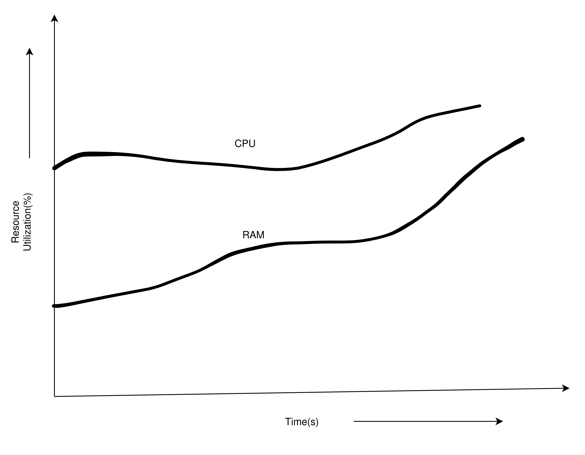

### 1.6 The Time-Series Nature of Observability Data

At its core, observability is really just the study of how a system behaves over time. Because of that, every single piece of telemetry data ends up being a time-series event. If everything isn't strictly tied to a clock, it becomes completely impossible to line up the clues when a system crashes. 

* **Metrics** are just quick snapshots of the system's health at a specific, exact second. They look like this: `(timestamp, value)`. Think of it like a nurse checking a patient's heart rate every sixty seconds. The system simply records that at exactly 10:05 AM, the server CPU was at 90 percent. A metric doesn't explain *why* the CPU was so high; it just plots the number on a timeline so engineers can easily spot trends or sudden, terrifying spikes.
* **Logs** are basically digital diary entries for the server. They look like this: `(timestamp, string)`. While a metric just gives a raw number, a log gives the actual story of what happened at that exact second. So, right when the metric showed the CPU spiking at 10:05 AM, the log might record a text entry saying, "At 10:05 AM, the server ran out of memory trying to load a massive image file." 
* **Traces** act more like a stopwatch for a specific task. Instead of just one single timestamp, they form a bounding box of time: `(start_time, end_time, operation)`. If a customer clicks a checkout button, a trace records exactly when that click happened, and then records exactly when the final confirmation screen finally loaded. It captures the total duration of the operation from start to finish, making it incredibly easy to see exactly which piece of the code took way too long to finish.

Since all three of these pillars share the exact same timeline, engineers can jump between them effortlessly. If a massive CPU spike shows up on a metric graph at 10:15:30, structured logs can be filtered to that exact same minute, and the tracing backend can be searched for operations that started right in that window. This shared clock is the only thing that actually ties all this disparate data together into something useful.

Since all three pillars share a timeline, engineers can jump between them pretty seamlessly. If a CPU spike shows up on a metric graph at 10:15:30, structured logs can easily be filtered to 10:15:25 - 10:15:35, and the tracing backend can be searched for spans that started right in that same window. This shared time-series foundation is what ties all this disparate data together into something actually useful.

---

## 2. Data Collection Architecture

If metrics, logs, and traces are the *what* of observability, the data collection architecture is definitely the *how*. Generating telemetry data doesn't help at all if it can't be safely and efficiently transported over to a backend analysis system.

### 2.1 The Role of the Collector

#### What is a Collector?
A collector is basically a vendor-agnostic proxy (or middleware) that receives, processes, and then exports telemetry data. It acts sort of like a dedicated data pipeline just for observability. The OpenTelemetry (OTEL) Collector is currently the standard for this.

#### Why not send data directly to the backend?
Sometimes beginners will instrument their app code to send data straight to a backend API (like Datadog, New Relic, or Prometheus), which makes the system really tightly coupled. This is generally considered an anti-pattern for production. Collectors are used instead for a few key reasons:
* **Decoupling & Vendor Lock-in:** If an app sends data directly to Vendor A, moving to Vendor B later means rewriting the app code. A collector acts as a nice buffer; the app sends standard data (like OTLP) to the collector, and then the collector handles translating it to whatever format the vendor needs.
* **Performance & Offloading:** Sending data across the internet involves TLS handshakes, dealing with retries, and batching. Making an application do all that wastes CPU and memory that should be spent serving users. A collector offloads all of that extra work.
* **Credential Management:** API keys for the backend shouldn't be floating around embedded in hundreds of microservices. The collector can hold the keys, while the microservices just chat with the local collector over the internal network.

#### Architecture Diagram: The Data Flow

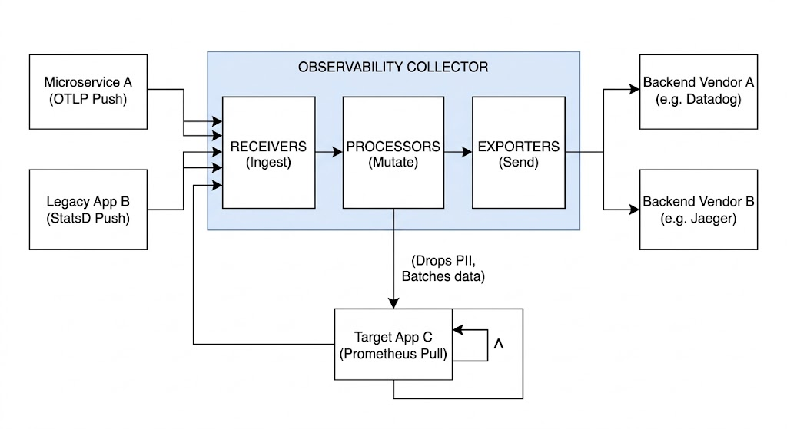

### 2.2 Collection Models

#### Agent-Based Collection
In this setup, an agent is just a collector that gets deployed right alongside the application, usually as a background daemon on a VM or as a "sidecar" container in Kubernetes.
* **How it works:** The app sends its telemetry to `localhost:4317` (the local agent). The agent processes it and then sends it off to the centralized backend.
* **Pros:** It offers extremely low latency for the application, and it's highly resilient to network issues (the agent can just buffer data to disk if the internet drops).
* **Examples:** Datadog Agent, OTEL Collector (running as a DaemonSet/Sidecar), Telegraf.

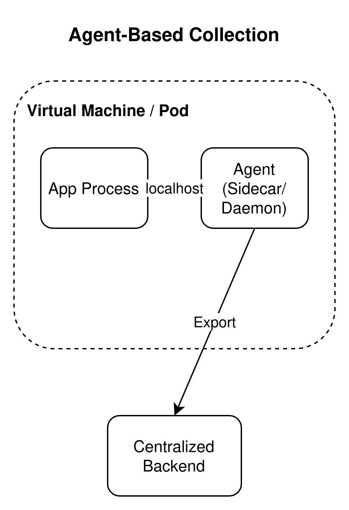

#### Agentless Collection
Here, data is collected without having to install a dedicated agent on the host machine.
* **How it works:** This is frequently done via Cloud Provider APIs (like pulling AWS CloudWatch metrics straight into the observability platform) or by having applications use heavier SDKs to send data directly to an endpoint.
* **Pros:** There's zero infrastructure to manage, which makes it ideal for serverless environments (like AWS Lambda) where background daemons can't really be run.
* **Cons:** It's less resilient to network blips, and it can introduce some performance overhead directly into the application.

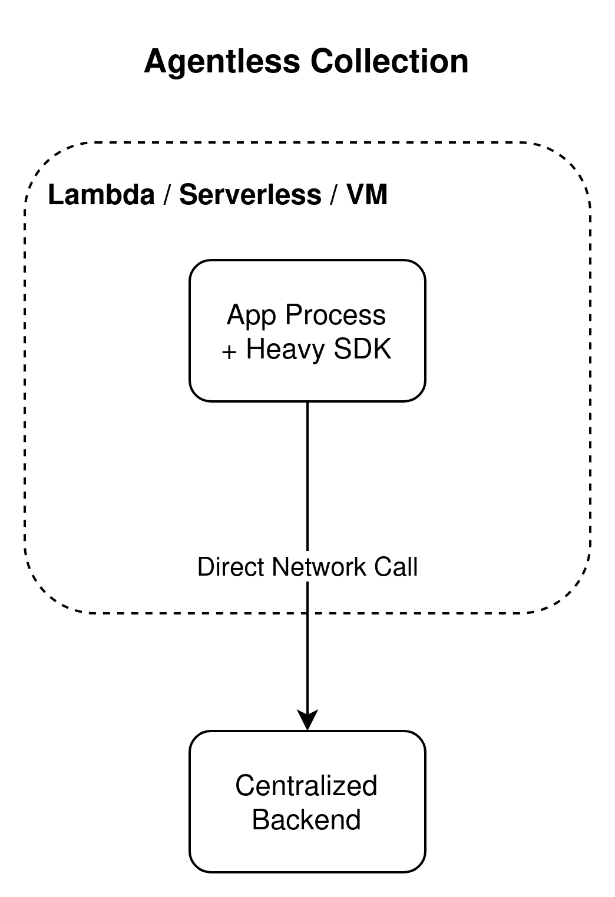

#### eBPF-Based Collection
eBPF (Extended Berkeley Packet Filter) lets teams run sandboxed programs directly inside the operating system kernel without having to change kernel source code or load modules.
* **How it works:** eBPF hooks right into the kernel's network stack and system calls. It can watch every HTTP request, database query, and network packet that flows through a node.
* **Advantages:** It acts as "zero-code instrumentation." Organizations can get massive amounts of system and network data without altering a single line of app code or dropping in SDKs.
* **Differences:** Traditional agents rely on the application to voluntarily report its data. eBPF just observes the application from the outside, right at the OS level.

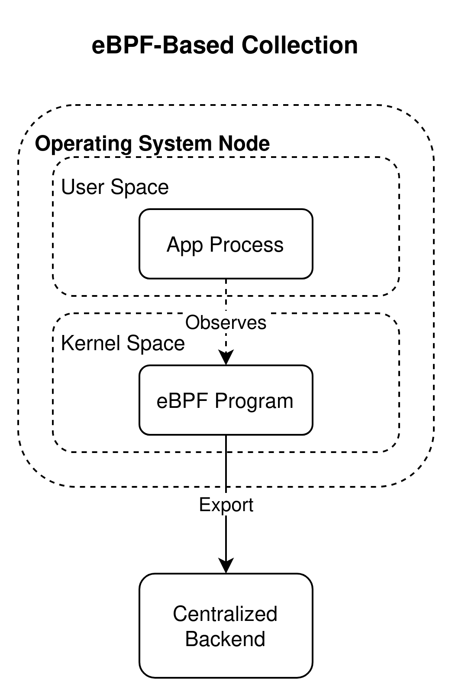

### 2.3 Push vs. Pull Models

When thinking about how data gets from the source to the collector, there are two main ways:
* **Push Model (e.g., OTLP, StatsD):** The application actively pushes data out to the collector as events occur.
  * *When to use:* This is usually best for traces and logs (which are naturally event-driven), and it's practically required for ephemeral workloads (like serverless functions or quick batch jobs) that might spin down before a collector even gets a chance to scrape them.

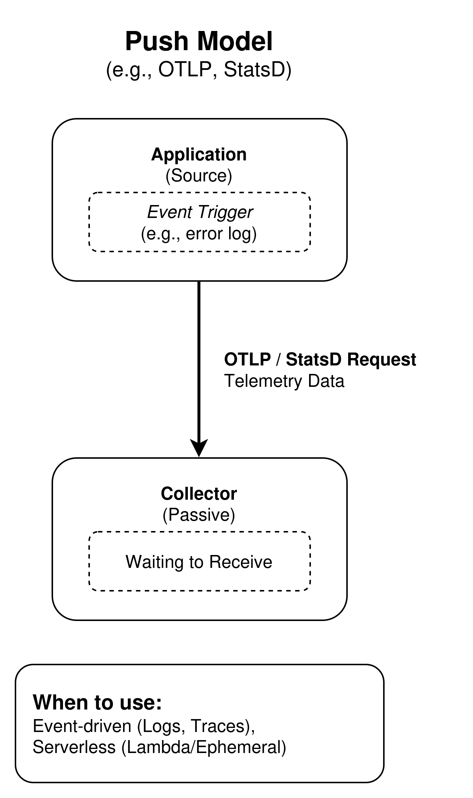

* **Pull Model (e.g., Prometheus):** The application exposes a passive endpoint (like `/metrics`). The collector runs on a timer (say, every 15 seconds) and makes an HTTP request to pull the data.
  * *When to use:* This is great for infrastructure metrics. It stops the backend from getting overwhelmed because the collector is the one controlling the rate of ingestion. It also makes finding targets easier (if a node goes down, the pull fails, which can instantly trigger an alert).

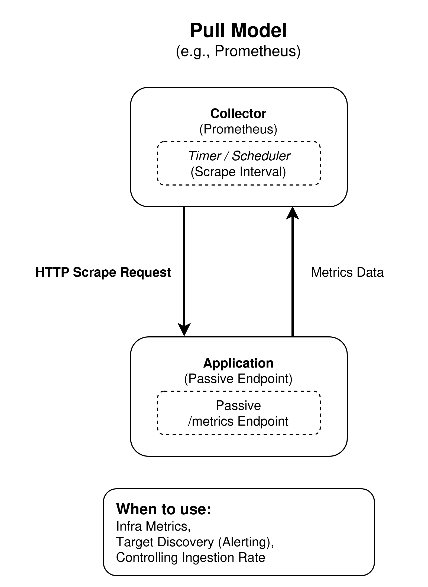

### 2.4 Processing at the Collection Point

The Processors block in the architecture is where a lot of the magic actually happens. A collector can mutate the data in-flight before it ever reaches the expensive storage backend.
* **Filtering:** Dropping data that isn't really valuable enough to pay to store.
  * *Examples:* Tossing out `/healthcheck` HTTP traces (since they happen every 5 seconds and just create noise), or using regex to redact things like credit card numbers from log payloads.
* **Sampling:** Picking a representative subset of traces to keep instead of storing 100% of them.
  * *Probabilistic Sampling:* Just keeping 10% of all traces randomly. It's simple, but rare errors might get missed.
  * *Head-based Sampling:* The decision to keep or drop the trace is made right at the start of the request. It performs well, but it blindly decides without knowing if the request will end up failing later.
  * *Tail-based Sampling:* The collector waits until the whole trace is finished before making a decision. This allows for rules like: "Keep 100% of traces with an error, but only keep 5% of the successful ones." It does require a lot of memory in the collector to buffer the traces while it waits.
* **Buffering and Batching:** Instead of making 1,000 tiny network requests to the backend, the collector bundles them up into a single payload and compresses them with gzip. This cuts down network egress costs and helps avoid API rate-limiting.
* **Metadata Enrichment:** Adding environmental context to the data. The application might only know it is called "PaymentService". The collector can append tags like `cloud_provider=AWS`, `region=us-east-1`, and `kubernetes_cluster=prod-cluster`.
* **Protocol Translation:** Taking in legacy data (like UDP StatsD) and converting it over to newer formats (like gRPC OTLP) so the backend only has to worry about one unified schema.


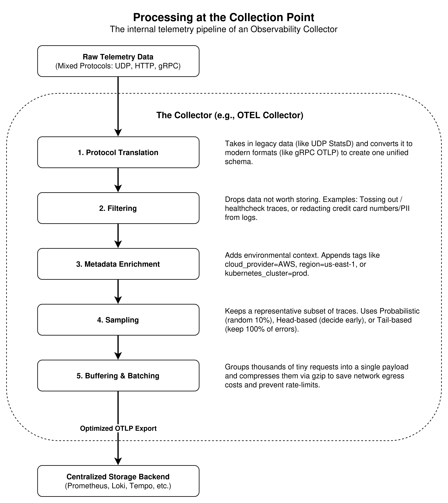

Here is the elaborated version of that section, written in that same conversational, third-person notes style to blend perfectly into your document. 

Following the text, I have included the `draw.io` XML for a monochrome stacked-layer diagram that visually explains how all this data funnels into a single collector.

***

### 2.5 Collection at Different Layers

* **Application Layer:** This is where the actual business logic lives. By instrumenting the code (either automatically or manually), teams can extract the exact context of what a user is trying to do. This layer spits out distributed traces and application logs, telling the story of specific function execution times, what exact user ID made the request, or even custom business metrics like how many items were sitting in a shopping cart when a timeout happened.
* **System Layer:** This sits right below the application. Data here is usually grabbed by a host agent running directly on the virtual machine or Kubernetes node. It focuses entirely on the raw physical or virtual resources being consumed—things like CPU usage spikes, RAM exhaustion, and disk I/O bottlenecks. It’s also where standard OS-level logs (like syslog or Windows Event Logs) get scraped to see if the operating system itself is complaining about anything.
* **Network Layer:** This is all about the traffic moving between the different pieces of the infrastructure. Data is typically collected using network appliances, service meshes, or cloud provider tools like VPC Flow Logs. It provides a massive amount of information on bandwidth usage, connection tracking between microservices, and whether packets are getting dropped silently by a firewall before they ever even reach the application layer.
* **Kernel Layer:** This is the absolute lowest level of the stack, and it's where eBPF (Extended Berkeley Packet Filter) really shines. Instead of asking the application what it's doing, eBPF watches the actual operating system kernel to get the unvarnished truth. It provides incredibly deep, low-overhead visibility into things that are usually totally invisible, like microscopic TCP retransmits, exact DNS resolution times, and granular file system operations, all without having to change a single line of app code.

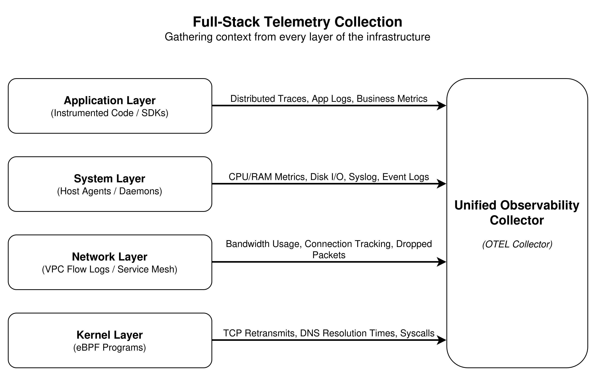

### 2.6 Auto-Instrumentation vs. Manual Instrumentation

To extract data from the Application Layer, developers have to instrument their code.

#### Auto-Instrumentation
This involves using a language-specific agent (like a Java JAR or Node.js module) that dynamically injects observability code into the application while it runs, usually by hooking into common frameworks (like Spring, Express, or Django).
* **Pros:** It provides instant value with zero code changes required. It instantly provides traces for HTTP requests, database queries, and caching layers.
* **Cons:** The data tends to be pretty generic. It might record that a database query took 50ms, but it won't know the business context of why that actually matters. It can also occasionally add a slight bit of latency overhead.

#### Manual Instrumentation
This is when developers explicitly write code using SDKs to generate telemetry (for example, `span.setAttribute("user.tier", "premium")`).
* **Pros:** It gives high-fidelity, business-specific data. Engineers have total control over what is measured and exactly when.
* **Cons:** It takes engineering time and effort. Also, if a developer simply forgets to instrument a critical path, it leaves a blind spot.

> **Best Practice:** Usually, the best approach is starting with Auto-Instrumentation to get a solid baseline, and then layering on Manual Instrumentation to enrich the really critical business paths with specific context.

---

## 3. Backend Pipeline Architecture

Once telemetry data is collected, it has to be transported, processed, stored, and eventually queried. The backend pipeline is basically the heavy-lifting engine of the whole observability setup. It has to ingest massive, relentless streams of write-heavy data while at the same time serving up complex read queries for dashboards and alerts.

### 3.1 End-to-End Data Flow

Here is a look at the high-level architecture of a modern observability backend.

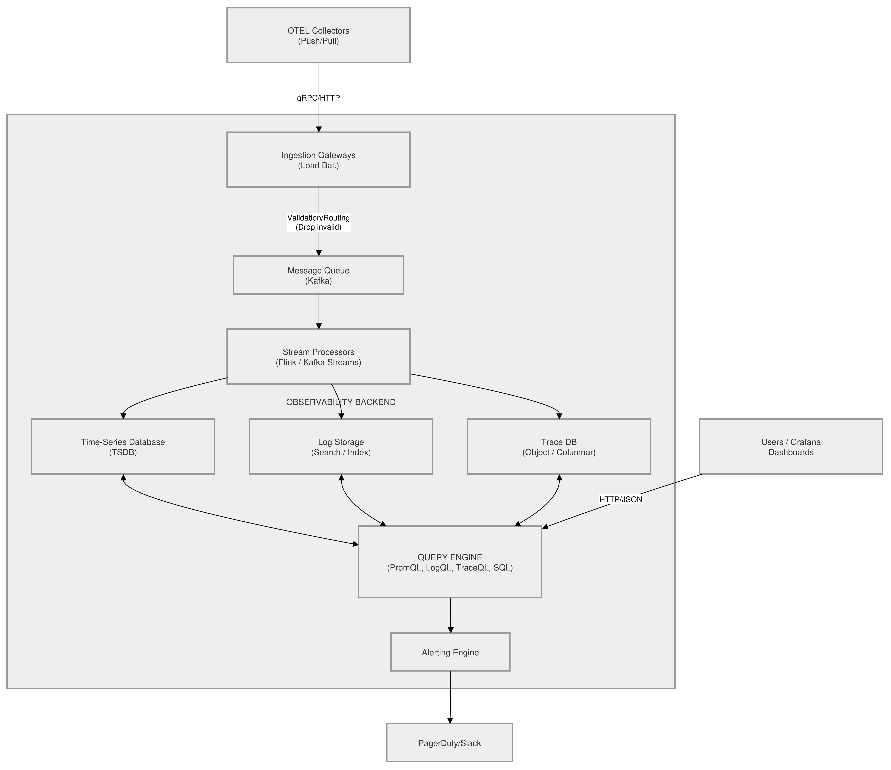

### 3.2 Ingestion Layer

The ingestion layer acts kind of like the front door for the data. Its main job is to accept data as quickly as possible without crashing, so no telemetry gets lost during a big traffic spike.
* **How data arrives:** 
    * **gRPC:** This is usually the preferred protocol for modern pipelines (like OTLP). It uses HTTP/2, allowing multiple streams to be multiplexed over a single TCP connection, which drastically lowers overhead.
    * **HTTP/REST:** Just standard JSON payloads. It's a bit slower than gRPC because of the parsing overhead, but it is universally supported.
    * **TCP/UDP:** Typically used by older legacy protocols (like syslog or StatsD). Keep in mind HTTP is built on top of the TCP protocol anyway. UDP is generally just meant for broadcasting fire-and-forget messages.
* **Load Balancing:** Since telemetry data is usually a continuous stream, Layer 4 (TCP) load balancers or specialized Layer 7 (gRPC-aware) proxies (like Envoy) are put in place to distribute the incoming connections evenly across the ingestion gateways.
* **Message Queues (The Buffer):** Once the data hits the gateway, it usually gets dumped immediately into a distributed log (like Apache Kafka or AWS Kinesis). This decouples the ingestion from the actual processing. If the storage database happens to go down, Kafka will hold the data safely until the database is back up.
* **Validation and Routing:** The gateway usually does a quick sanity check. Is the payload malformed? Is the API key actually valid? If everything looks good, it routes the data to the correct Kafka topic (like `metrics-topic` or `logs-topic`).

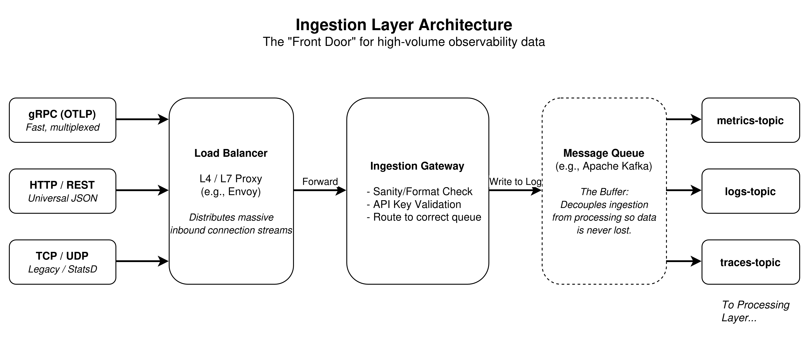

### 3.3 Processing Stages

Data sitting in Kafka is pretty raw. Stream processors (like Apache Flink, Kafka Streams, or internal OTEL collector pipelines) pull this data and get it ready for storage.
* **Parsing and Normalization:** This involves extracting JSON fields, parsing weird timestamps into standard Unix epochs, and making sure naming conventions are standard (like changing `host_name` to `hostname` across all incoming logs).
* **Enrichment:** Adding lookup data to the stream. For example, taking a bare IP address found in a log and attaching `geo_location=US`, or appending specific Kubernetes pod metadata.
* **Aggregation:** Instead of storing every raw data point, the pipeline can compute summaries on the fly.
  * *Example:* If a service is sending 1,000 "checkout successful" spans every second, the stream processor might just aggregate that into a single metric: `checkout_success_rate = 1000/s` before it ever even touches the database.
* **Rollups (Downsampling):** High-resolution data (like 1-second intervals) costs a lot to keep forever. Processors can automatically create "rollups" for the older data. Data older than 7 days might get averaged out into 1-minute intervals, and data older than 30 days gets rolled into 1-hour intervals.
* **Indexing Strategies:** Deciding exactly what fields to index. For logs, things like `tenant_id` and `status_code` might get indexed for lightning-fast lookups, but the bulky raw message body is left unindexed to save on disk space.

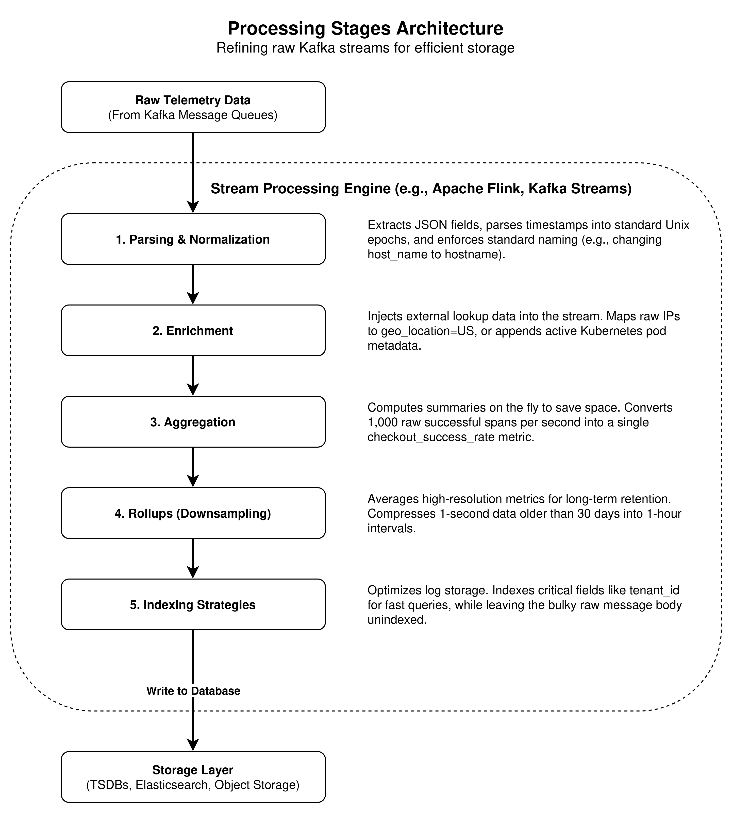

### 3.4 Storage Layer

Different observability data types have fundamentally different shapes and access patterns, which is why different types of databases have historically been used for each pillar.

#### Why different storage for different data types?
* **Metrics (TSDBs):** Time-Series Databases (like Prometheus, M3DB, or VictoriaMetrics) are highly optimized for storing arrays of numbers keyed by timestamps. They use delta-of-delta compression (meaning they only store the *difference* between consecutive numbers), which allows millions of data points to easily fit into just a few megabytes of RAM.
* **Logs (Inverted Indices vs. Columnar):** Logs are heavy, unstructured chunks of text.
  * *Elasticsearch:* Uses an inverted index (kind of like the index at the back of a book). It's super fast for searching things like "error AND timeout", but it requires massive amounts of CPU and RAM to build and maintain that index.
  * *Loki:* This takes a different approach by only indexing the metadata (the labels) and then storing the bulky log text in cheap object storage (like S3). It's slower for brute-force text searches, but it is drastically cheaper to run.
* **Traces (Object/Columnar):** Traces are complex directed acyclic graphs (DAGs). Modern tools like Grafana Tempo tend to store the raw trace data as massive blocks in AWS S3 and only keep a tiny index active in memory.

#### Hot vs. Warm vs. Cold Storage
To manage massive scale without going broke, data is usually tiered based on its age:
* **Hot:** Data from the last 1–3 days. This is usually stored on expensive NVMe SSDs in memory. It's used for real-time alerting and immediate incident response.
* **Warm:** Data from 3–30 days. Stored on standard block storage (like EBS). It's used for week-over-week trend analysis, and queries are naturally a bit slower.
* **Cold:** Data older than 30 days. This is stored in highly compressed formats on cheap Object Storage (S3/GCS). It's mostly kept around for compliance audits or quarter-over-quarter reporting.

### 3.5 Query Layer

#### Query Languages
* **PromQL:** This is the go-to language for Prometheus, and it functions a bit differently than standard database queries. It acts more like doing functional math on arrays of numbers over time. Engineers rely on it to take raw counters and instantly turn them into usable rates or percentiles. For example, it allows a team to take millions of raw HTTP hits from the last five minutes, calculate the per-second rate, and seamlessly group the results by data center to see if one specific region is getting slammed harder than the others.
* **TraceQL:** A language built specifically by Grafana for digging through distributed traces. Instead of just filtering by basic tags, it allows engineers to search the entire structure of a request—like finding a trace that hit the billing service, took longer than two seconds, and ended with a database error.
* **LogQL / Lucene:** These are the heavy lifters for sifting through massive walls of text. Lucene is what powers Elasticsearch, acting like a super-powered search engine to find specific keywords across clusters. LogQL is Grafana's spin on this for Loki, essentially taking the label-filtering style of PromQL and mashing it up with regular expressions. It allows developers to quickly hunt down a specific error string hiding inside gigabytes of raw server output, and it can even extract numbers directly from the text to build a quick graph on the fly.
* **SQL (ClickHouse):** SQL is making a massive comeback in the observability world, largely thanks to blazing-fast columnar databases like ClickHouse. Instead of forcing teams to learn three completely different, highly specialized languages for metrics, logs, and traces, SQL offers a single, deeply familiar syntax that almost every engineer already knows. It makes it incredibly easy to just write standard `SELECT` and `GROUP BY` statements to dig through terabytes of unified telemetry data without having to consult a cheat sheet for a brand-new language.

#### How are Queries Optimized?
Modern query engines used for observability sort of act like distributed compilers. They take the query, break it down, and try to figure out the absolute cheapest way to execute it.

**1. Filter Pushdown and Index Lookups**
The fastest data to process is data that never actually has to be read. Before reading a single raw data point from the disk, the engine checks the **Index** (often an inverted index).
* If a query asks for `rate(http_requests{env="prod", service="checkout"}[5m])`, the engine looks at the index to find the exact memory addresses or file blocks where `env="prod"` AND `service="checkout"` intersect.
* It "pushes down" these filters to the very bottom of the storage layer so it only ends up pulling the specific megabytes of data it actually needs, instead of scanning the entire database.

**2. The Scatter-Gather Pattern (Parallel Execution)**
Observability databases tend to be highly distributed. If a query spans 30 days of data, that data is likely split up across dozens of different storage nodes.
* **Scatter:** The central query gateway breaks that single query down into 30 separate 1-day queries and *scatters* them to the 30 different storage nodes all at once.
* **Gather:** Each node computes its 1-day result in parallel and sends it back to the gateway. The gateway then *gathers* these partial answers, stitches them together, and hands the final graph to the user. This can easily turn a 30-second query into a 1-second query.

**3. Automatic Resolution Switching (Downsampling)**
If a user is trying to look at a graph spanning 6 months, their computer monitor probably only has about 2,000 pixels across. It is physically impossible to display 1-second resolution data (which would be 15 million data points) on a 2,000-pixel screen.
* Smart query engines will detect the time window requested by the dashboard.
* If the window is huge, the engine automatically rewrites the query behind the scenes to fetch the pre-computed **1-hour rollups** instead of pulling the raw 1-second data, which saves massive amounts of CPU time and network bandwidth.

**4. Abstract Syntax Tree (AST) Rewriting**
When a complex query is written, the engine parses it into a tree of mathematical operations. An optimizer will then mathematically rearrange the query to make it faster, without changing the final answer.
* For example, it will reorder operations so that the most restrictive filters happen *first*, which reduces the dataset size before it attempts to apply heavy math functions (like calculating percentiles or standard deviations).

**5. Tiered Caching**
Query engines also use aggressive, multi-layered caching to avoid repeating work:
* **Metadata Caching:** Caching the inverted index. (e.g., Remembering exactly which files contain `service="checkout"` so it doesn't have to look it up again later).
* **Sub-query / Chunk Caching:** If a dashboard pulls data for the last 24 hours, and the user refreshes the page 5 minutes later, the engine *does not* recalculate the entire 24 hours. It just grabs the first 23 hours and 55 minutes from the cache, computes only the newest 5 minutes, and merges them together.

#### Aggregation at Query Time vs. Storage Time
* **Query Time:** This involves storing raw data and doing all the math when the user actually loads the dashboard. *Trade-off:* It gives maximum flexibility to slice the data arbitrarily, but complex dashboards can end up being terribly slow to load.
* **Storage Time (Recording Rules):** This involves pre-computing the math during the ingestion processing stage and storing the final answer as a new metric. *Trade-off:* Dashboards will load instantly, but if an engineer suddenly needs to group the data by a new dimension that wasn't pre-computed, they are out of luck.

### 3.6 Bottlenecks in the Pipeline

Architecting an observability backend is essentially just an ongoing exercise in managing bottlenecks:
* **Ingestion Network Saturation:** A sudden traffic spike to an application will result in a massive spike in telemetry. This can easily saturate network bandwidth, causing packets to drop before they even make it to the collector.
* **Kafka Partition Hotspotting:** If data routing isn't balanced well (like routing all logs by `tenant_id`, and one massive tenant ends up generating 90% of the traffic), a single Kafka partition will get totally overwhelmed while the others just sit idle.
* **TSDB Cardinality Explosions:** As discussed earlier, adding a high-cardinality tag (like `session_id`) to a metric will pretty much instantly exhaust the RAM of a Time-Series Database, causing it to crash due to an Out-Of-Memory (OOM) error.
* **Heavy Read Queries:** Letting a user run a massive regex search over 30 days of unindexed log data will consume all the available CPU on the storage nodes. If reads and writes are sharing the same hardware, this will end up slowing down the entire ingestion pipeline.

### 3.7 Architecture Comparison

Here is a quick look at how different industry approaches tend to solve the observability backend problem.

| Feature / Aspect | Proprietary SaaS (e.g., Datadog) | Open Source LGTM Stack (Grafana) | Modern Columnar (e.g., ClickHouse + OTEL) |
| :--- | :--- | :--- | :--- |
| **Components** | Proprietary Agent → Datadog Cloud | Promtail/OTEL → Mimir, Loki, Tempo | OTEL Collector → Kafka → ClickHouse |
| **Storage Engine** | Proprietary / Hidden | Dedicated DBs per pillar (TSDB, Object) | Unified OLAP Database (Columnar) |
| **Query Language** | Proprietary UI / APIs | PromQL, LogQL, TraceQL | Standard SQL |
| **Operational Overhead** | **Low:** Fully managed, with zero infra to maintain. | **High:** Requires managing multiple databases and storage tiers. | **Medium:** Requires deep database tuning, but there's only one database to manage. |
| **Cost Structure** | **High:** Billed per host, per ingested GB, per indexed span. | **Low (Software) / Med (Infra):** Teams pay only for their AWS/GCP compute and S3 storage. | **Low:** ClickHouse compression yields incredibly cheap disk usage. |
| **Primary Advantage** | Seamless, out-of-the-box correlation between the pillars. | Maximum composability; scales massively on cheap S3 storage. | Unmatched query speed over massive datasets; totally unified data model. |

---

## 4. Intelligence Layer: Insights, Anomalies, and RCA

Just collecting and storing millions of metrics, logs, and traces is really only half the battle. If a human engineer has to sit there and manually sift through dashboards to find a problem, the observability system isn't doing its job well. The Intelligence Layer acts as a mathematical overlay that automatically extracts meaning from the raw telemetry, figures out when things are going wrong, and helps guide teams straight to the root cause.

### 4.A. Insights

#### What are "Insights" in Observability?
Insights are automated, actionable observations pulled from telemetry data without requiring a person to explicitly write out a query. While a basic metric simply reports `CPU = 85%`, an insight might pop up and report `"CPU has been trending upward by 5% daily and will likely exhaust capacity in 3 days."`

#### How are Insights Generated?
Insights get generated by running continuous background pipelines against the incoming data streams (like from Kafka), or by periodically querying the storage layer (like ClickHouse or Prometheus) and applying mathematical models to the results.

#### Pattern Recognition Techniques
* **Statistical Analysis:** This is the foundation of most insights. Instead of just looking at raw data, systems will look at:
  * *Percentiles (p95, p99):* "99% of the users are experiencing a load time of less than 2.1 seconds."
  * *Standard Deviation:* "The variance in response times has doubled since that last deployment."
* **Trend Analysis:** This involves comparing current data windows to historical baselines (for instance, comparing this Tuesday at 10 AM to the last four Tuesdays at 10 AM) to spot slow degradations that humans might miss.
* **Correlation Analysis:** Mathematically linking two totally disparate metrics. For example, automatically noticing that a sudden increase in `jvm_garbage_collection_time` strongly correlates with a drop in the `checkout_success_rate`.

#### Machine Learning Approaches
* **Clustering:** Used heavily when looking at logs. If a system suddenly throws 10,000 error logs, ML algorithms can strip out the variable data (like user IDs) and cluster them into distinct "patterns" or error types to cut down the noise.
* **Forecasting:** Using predictive models like ARIMA or Prophet to guess future states based on historical trends (e.g., predicting exactly when a database disk is going to fill up).
* **Classification:** Categorizing incidents. A model can learn that when a specific group of network metrics spikes right alongside database connection timeouts, it is highly likely to be a "Network Partition" event.

**Examples of Generated Insights:**
* *"API latency on `/v1/payments` increased 50% in the last hour compared to the 7-day baseline."*
* *"Log pattern 'Connection reset by peer' spiked 400x on Service X following a configuration change."*

### 4.B. Anomalies

#### What is an Anomaly?
In an observability context, an anomaly is just a data point (or a sequence of points) that deviates pretty significantly from the expected "normal" behavior of a system.

#### Anomaly Detection Methods
* **Threshold-Based (The Simplest Method):**
  * *Static:* Setting an alert if CPU > 90%. (The problem is that 90% might be totally normal during a nightly batch job, which leads to alert fatigue).
  * *Dynamic:* Setting an alert if the error rate > 5%, but only if traffic is currently > 100 requests/sec.
* **Statistical Methods:**
  * *Z-Score:* This measures how many standard deviations a data point is away from the mean. If a metric generally has a normal distribution, a Z-score of > 3 indicates an extreme outlier.
  * *Interquartile Range (IQR):* This is more robust than a Z-score because it isn't easily skewed by massive outliers. It looks at the middle 50% of the data and flags points that fall far outside that central box.
  * *Moving Averages (EWMA):* Exponentially Weighted Moving Averages smooth out noisy data so alerts only end up triggering on sustained deviations, rather than momentary blips.
* **Machine Learning:**
  * *Isolation Forests:* An algorithm that builds decision trees to try and isolate anomalies. Since anomalies are rare and different, they require fewer "splits" to isolate than normal data does.
  * *Autoencoders (Neural Networks):* An AI model is trained to compress and reconstruct normal, healthy system data. When it is fed anomalous data, the model struggles to reconstruct it, which results in a high "reconstruction error" that triggers the alert.
  Here is the missing point on LSTMs, written in that same conversational, easy-to-read style so you can just drop it right into the Machine Learning bullet points under the **4.B. Anomalies** section:
  * *LSTMs (Long Short-Term Memory):* This is a specific kind of neural network that is really good at looking at sequences of data over time, which makes it perfect for time-series metrics. Basically, an LSTM looks at the recent history of a metric and learns its normal rhythm so it can guess what the next data point should be. If the actual number that comes in is way off from what the LSTM predicted it would be, the system flags it as an anomaly. It's super useful because it actually "remembers" the context of what was happening just a few minutes ago.

#### Handling Seasonality and False Positives
A massive drop in web traffic at 3:00 AM isn't usually an anomaly; it just means people are sleeping. Effective anomaly detection has to account for seasonality (daily, weekly, or yearly cycles). Tools usually handle this by comparing current data to the exact same time window from previous cycles.

To help reduce false positives (alert storms that cause engineers to just ignore the alarms), modern tools will use duration constraints (like, "This must be anomalous for 5 consecutive minutes") and severity classification (labeling an anomaly as "Warning" vs "Critical" based on the actual business impact).

**Severity classification:** This is basically just grading how bad a problem actually is, because not every single anomaly should wake an engineer up at 2 AM. If a background job is running a little slower than usual, the system might just slap a "Warning" label on it, so you can look at it tomorrow over coffee. But if the main checkout page is totally broken, that gets a "Critical" tag because it's actively losing the company money right now. It really helps cut down the noise, so people only panic when they actually need to.

#### How to Implement Basic Anomaly Detection (Flowchart)
Here is a conceptual architecture for putting together a Z-score based anomaly detector:

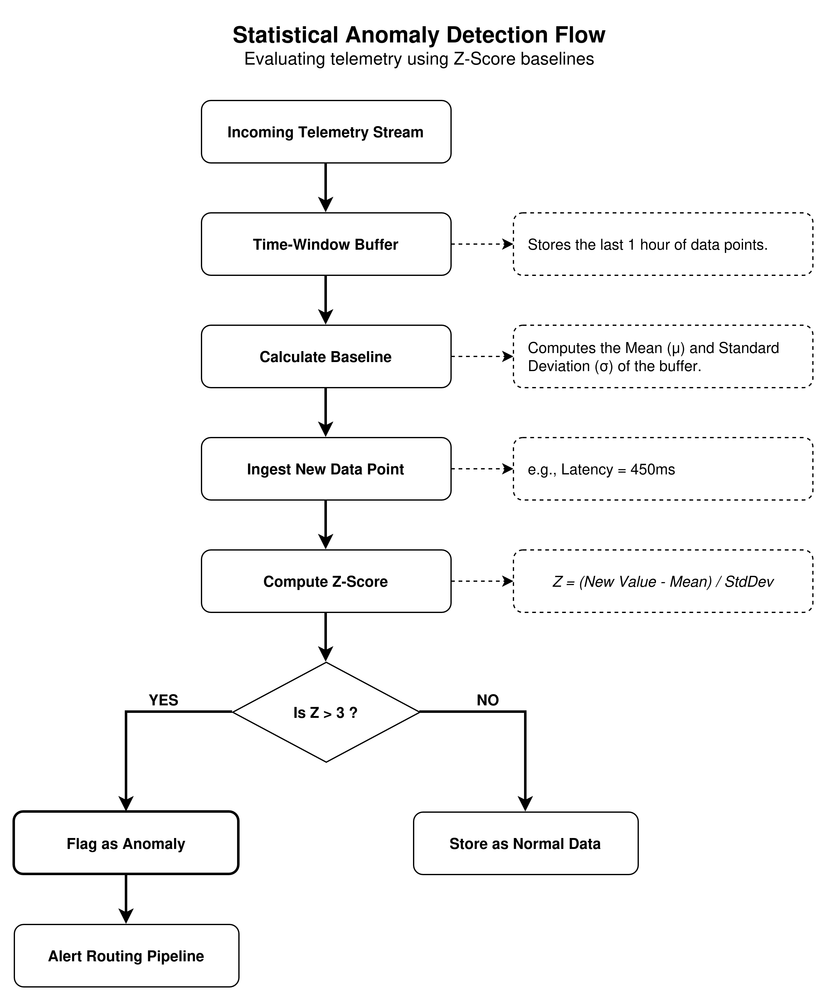

### 4.C. Root Cause Analysis (RCA)

#### What is RCA, and Why is it Hard?
RCA is simply the process of tracing a system failure all the way back to its fundamental origin. In modern microservice architectures, RCA is incredibly difficult mostly due to cascading failures. If a User Service relies on a Payment Service, which relies on a Database, a locked database table will cause the Payment Service to time out, which eventually causes the User Service to throw 500 errors to the client.

The symptom (the User Service failing) is completely detached from the actual root cause (the Database lock).

#### RCA Techniques
* **Correlation analysis across metrics:** This is basically just looking to see which metrics changed at the exact same time. If you notice that your server's CPU suddenly spiked to 100%, and right at that exact same second, your checkout error rate shot up, you can guess those two things are probably connected. It helps you piece the whole story together just by seeing what broke at the same time.
* **Dependency Mapping:** Using trace data to automatically draw up a topology map of how services are communicating. This allows engineers to visually trace a failure "downstream" to the lowest level.
* **Trace Analysis (Critical Path):** Analyzing a distributed trace to find the exact span (the specific operation) that consumed the most time or threw the fatal exception.
* **Log Aggregation & Pattern Matching:** Once the failing span is found, centralized logs can be filtered to the exact `trace_id` to read the specific error message generated by the code.
* **Change Event Correlation:** A massive percentage of outages are caused by a change. If a sudden spike in resource usage is observed exactly when a deployment finishes, the root cause is almost certainly the new code.

#### What Data is Needed for Effective RCA?
* High-fidelity Distributed Traces (ideally with 100% sampling for errors).
* Contextualized Structured Logs (Logs absolutely must include `trace_id` and `span_id`).
* Infrastructure Metrics (Just to rule out physical issues like "the node ran out of memory").
* Change Tracking Data (Info on deployments, feature flag toggles, or config updates).

#### Example RCA Workflow & Tool Representation

Let's try to understand RCA workflow with a real world example:

**Scenario: High Latency Alert**

1.  **The Alert (Symptom):** PagerDuty pings the on-call engineer. The engineer clicks the link, which opens up the Observability Dashboard.
    * *UI Mockup (Metrics View):* A time-series graph is showing a sharp red spike. `global_checkout_latency` has suddenly jumped from 200ms to 4000ms. An overlay line on the graph shows a "Deployment Marker" exactly 2 minutes before the spike started.
2.  **Identify Affected Service (Dependency Map):**
    * *UI Mockup (Service Map):* A web of circles shows the topology. The `API-Gateway` circle is glowing yellow. An arrow points from it to the `Inventory-Service` circle, which is glowing bright red. It becomes pretty clear the bottleneck is inside Inventory.
3.  **Find Slow Traces:**
    * *UI Mockup (Trace Waterfall):* The engineer clicks into `Inventory-Service`. The trace waterfall shows that `GET /inventory` takes 4.0s. Expanding it reveals that a child span `SELECT * FROM stock_table` is taking up 3.9s of that time.
4.  **Correlate with Logs:**
    * *UI Mockup (Log Panel):* Next to the trace, a side-panel automatically filters logs that match that exact transaction. The log reads: `WARN: Query executed without index. Scanning 4 million rows.`
5.  **The Root Cause:**
    * This correlates perfectly with the deployment marker from Step 1. The recent deployment must have dropped a critical database index.
    * *Resolution:* The immediate resolution involves rolling back the deployment. The incident is resolved.

---


## 5. Observability User Experience (UX)

The user experience of an observability platform is arguably as important as its ingestion pipeline. If the backend can process a million spans a second, but the frontend requires an engineer to write a 10-line query just to see the error rate, the tool will fail during a high-stress incident. The goal of observability UX is to minimize Mean Time To Resolution (MTTR) by reducing cognitive load.

### 5.A. Dashboard Patterns

#### Common Visualization Types
A well-designed dashboard uses specific visualizations for specific types of data.
* **Time-Series Graphs (Line/Area):** The workhorse of observability. Used for continuous metrics (CPU, request rate). *UX Best Practice:* Use stacked area charts when showing the composition of a whole (e.g., HTTP 200s vs 400s vs 500s making up total traffic).
* **Heatmaps:** Essential for visualizing latency distribution. Instead of just showing the "average" latency (which hides outliers), a heatmap shows the concentration of requests at various latency buckets over time.
* **Histograms:** These are incredibly useful for showing how data is actually distributed across different ranges or buckets. Instead of just looking at one flat number, a histogram lets engineers see exactly how many requests fell into the "superfast" bucket versus the "painfully slow" bucket. It provides a much clearer picture of the real user experience since it doesn't let massive outliers hide behind a simple, misleading average.
* **Gauges / Single-Stat Panels:** Used for quick "at-a-glance" status. Best for current state metrics (e.g., `Active Database Connections: 45/100`).
* **Tables and Log Views:** High-density text views for deep-dive investigation. Must include powerful column sorting and regex filtering.

#### Dashboard Organization
Dashboards should be structured hierarchically, reflecting the architecture:
* **Business KPI Dashboards:** High-level (Active Users, Checkout Success Rate, Revenue/min). Low information density. Designed for executives.
* **Application Dashboards (RED Metrics):** Focuses on the user experience of a specific service. Tracks **R**ate (requests/sec), **E**rrors (error rate), and **D**uration (p95 latency). Medium density.
* **Infrastructure Dashboards:** Low-level system resources (CPU steal time, disk IOPS, network dropped packets). High density. Designed for SREs and system admins.

#### Variables, Templating, and Density
* **Templating:** Hardcoding dashboards is an anti-pattern. A single "Service Detail" dashboard should have drop-down variables at the top (e.g., `Environment: [Prod/Staging]`, `Cluster: [US-East/EU-West]`, `Service: [Payment/Cart]`). Changing the drop-down dynamically updates all PromQL/SQL queries on the page.
* **Information Density:** A common UX mistake is cramming 50 graphs onto one page. Human working memory can only track a few things at once. The best dashboards keep the "Golden Signals" at the top "above the fold" and hide granular system metrics further down.

### 5.B. User Workflows

#### The Engineer's Mental Model: The User Journey
During an incident, an engineer's mental model shifts from broad exploration to narrow exploitation.

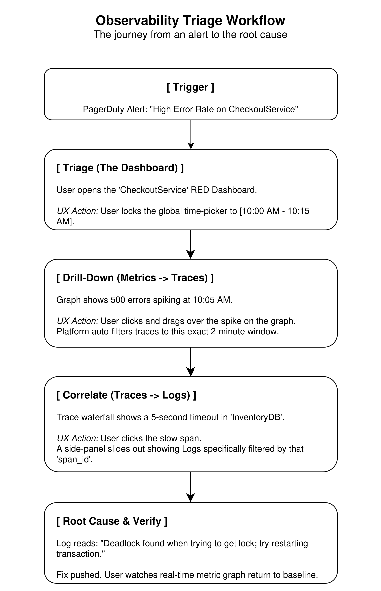

#### Critical UX Patterns for Workflows
* **Global Time-Sync:** This is the most important UX feature in observability. If an engineer zooms in on a metric graph from 10:01 to 10:03, every other panel, including the log search and trace search, must instantly sync to that exact time window.
* **Context Preservation:** When clicking from a Metric Dashboard to a Log Search page, the platform must carry over the current filters (e.g., `env=prod`, `service=checkout`) in the URL or local state. Forcing the user to re-type filters breaks their train of thought.

### 5.C. Tool Analysis & Comparison

Let's examine three industry leaders: Datadog, Grafana, and New Relic.

| Feature / UX Aspect | Datadog | Grafana | New Relic |
| :--- | :--- | :--- | :--- |
| **Primary Mental Model** | Tag-based exploration. Everything is linked via standardized tags (`env`, `service`). | Panel-based visualization. Highly flexible but requires knowing query languages. | APM / Entity-centric. Focuses heavily on application code and service maps. |
| **Out-of-the-Box UX** | **Excellent.** Automatically generates RED dashboards and dependency maps without configuration. | **Fair.** Requires finding and importing community dashboards or building from scratch. | **Excellent.** Very strong auto-instrumentation UI out of the gate. |
| **Handling Large Data** | Aggregates data seamlessly at the UI level. Log tails are virtualized (infinitely scrolling). | Uses query-time downsampling. UI can freeze if querying too many unindexed logs. | Strong query performance; uses a proprietary, highly optimized database (NRDB). |
| **Learning Curve** | Low. Point-and-click UI makes it easy for junior devs to investigate. | High. Engineers must learn PromQL and LogQL to build useful panels. | Medium. Uses NRQL, which is very similar to standard SQL. |

#### What makes a dashboard intuitive?
* **Consistent Color Palettes:** Red always means error or danger. Green always means success. (Some poorly configured dashboards use a green line to represent HTTP 500s—this is an instant cognitive failure).
* **Clear Y-Axis Labels:** Are the numbers representing milliseconds or seconds? Bytes or Megabytes?

#### Potential Improvements
Current tools suffer from "Context Fragmentation." Even in Datadog, moving from a metric to a trace often opens a new browser tab or completely replaces the current screen.
* **A Structural Improvement:** Implement a "Split-Pane / Drawer" UX universally. When clicking a spike on a graph, the screen should not change. Instead, a drawer should slide up from the bottom occupying 40% of the screen, showing the exact logs and traces for that spike. Closing the drawer leaves the user exactly where they were.

### 5.D. Insight Presentation

How do platforms surface the "Intelligence" discussed in Section 4?
* **Overlay Markers (Annotations):** The simplest and most effective UX for insights. If an anomaly is detected, or a deployment occurred, a vertical shaded band or a pin is drawn directly on top of the metric graph. This provides immediate visual correlation.
* **The "Feed" Pattern:** Tools like Datadog have a "Watchdog" feed that acts like a social media feed for infrastructure. It presents cards that say: *"Traffic on API Gateway is unusually low. Impact: 5 services."*
* **Visualizing Anomalies:** Instead of a single line for a metric, the UI draws a solid line for the actual value, and a translucent shaded band representing the expected bounds (the confidence interval). If the solid line breaches the shaded band, it turns red.
* **RCA Presentation:** Modern tools use GenAI to summarize root causes. Instead of forcing the user to read 50 logs, a summary card appears at the top of the incident page: *"This incident is likely caused by a memory leak in `PaymentService` introduced in deployment `v2.4.1`, evidenced by 5 OOMKilled events in the last hour."*

---

## 6. Technical Challenges & Trade-offs

In software engineering, there are no perfect solutions, only trade-offs. Building and maintaining an observability pipeline is a constant battle against physics and economics. The very act of observing a complex distributed system generates a massive, complex, distributed data problem of its own.

Here is a breakdown of the core challenges and the hard choices engineers must make.

### 6.1 Data Volume & Cost: The "Observer Effect"

#### The Scale of the Problem
Modern microservices are incredibly chatty. A single service handling 1,000 requests per second can easily generate hundreds of gigabytes of logs and traces per day. For a mid-to-large enterprise, telemetry data routinely reaches petabytes per month.

#### The Trade-off: 100% Visibility vs. Bankruptcy
* **Storage and Network Costs:** Sending this data out of a cloud provider (network egress) and storing it in a vendor's SaaS platform (like Datadog or Splunk) can quickly become the single largest line item on an AWS bill, sometimes eclipsing the cost of the production infrastructure itself.
* **The Choice:** Organizations must decide whether to pay millions of dollars to store every single successful HTTP 200 OK log just in case it is needed for an audit, or aggressively drop data and risk having blind spots during an edge-case outage.

Existing tools force different choices. Datadog charges a premium for every gigabyte indexed, incentivizing teams to drop data at the collector. Conversely, tools built on ClickHouse or S3 (like Grafana Loki) make storage so cheap that organizations can afford to "log everything" but pay the penalty in slower query times.

### 6.2 Cardinality Explosion

#### What Causes It?
As covered in the Fundamentals section, high cardinality happens when unbounded data (like `user_id`, `email`, or `trace_id`) is attached as a label to a metric. If a metric has 1 million unique `user_id` values, it creates 1 million distinct time-series.

#### The Impact
Time-Series Databases (TSDBs) like Prometheus keep the active index in RAM for fast querying. A sudden cardinality explosion (e.g., a developer accidentally deploying code that tags a metric with a unique uuid per request) will cause the TSDB's memory consumption to spike vertically, resulting in an Out-Of-Memory (OOM) crash. This takes down the entire alerting infrastructure exactly when a bad deployment is happening.

#### Mitigation Strategies & Trade-offs
* **Strict Code Reviews / Linters:** Prevent high-cardinality tags from ever being merged into the codebase.
* **Collector Dropping:** Configure the OTEL Collector to silently strip dangerous labels before they hit the TSDB.
* **The Trade-off:** Granular metric slicing is lost. If `user_id` is stripped from the metric, the TSDB can no longer answer questions like, "Is this error rate spike affecting premium users?" Teams must instead rely on logs or traces to answer that question.

### 6.3 Sampling Trade-offs

Because storing 100% of distributed traces is economically unviable, data must be sampled. The question is how.

#### Head-Based Sampling
The decision to keep or drop a trace is made at the very beginning of the request (e.g., a coin flip at the API Gateway keeps 5% of traffic).
* **Pros:** Extremely low overhead. The system knows immediately not to bother generating spans for the dropped 95%.
* **Cons:** Data is blindly dropped. Traces of catastrophic errors will inevitably be dropped, leaving teams with no data to debug an outage.

#### Tail-Based Sampling
The system records 100% of traces, buffers them in memory at the collector level, waits for the transaction to finish, and then decides whether to keep it based on the outcome (e.g., "Keep 100% of errors and slow requests, but only 1% of normal requests").
* **Pros:** Errors are never missed. High-fidelity data for RCA.
* **Cons:** Requires massive amounts of RAM in the collector fleet to hold thousands of in-flight traces while waiting for them to complete.

*Tool Choices:* Traditional APMs default to head-based sampling for safety. Modern observability players like Honeycomb strongly advocate for tail-based sampling to ensure high-fidelity debugging data is always retained.

### 6.4 Real-time vs. Batch Processing

#### When is real-time needed?
Alerting requires real-time processing. If the database goes down, the on-call engineer needs to be paged within seconds, not minutes. Therefore, metrics and critical error logs must be processed via low-latency streaming (e.g., Kafka to Flink to TSDB).

#### When is batch processing used?
Cost efficiency, reporting, and SLA calculations. Real-time streams are not needed to calculate last month's 99.9% uptime metric.
* **The Trade-off:** Streaming architectures are complex, stateful, and expensive to run. Batch architectures (dumping logs to S3 and running an AWS Athena query once a day) are inexpensive but useless for incident response.

### 6.5 Storage Optimization

#### Compression vs. Query Speed
Data at rest must be compressed to save money. However, highly compressed data (like Parquet or gzip) requires CPU cycles to decompress before it can be searched.
* **The Trade-off:** Architectures can utilize cheap storage (highly compressed) OR blazing fast queries (uncompressed in RAM), but cannot have both simultaneously.

#### Downsampling and Retention Policies
Storing 1-second resolution metrics for a year is an inefficient use of disk space.
* **Strategy:** Keep 1-second data for 3 days (Hot). Downsample to 1-minute averages for 30 days (Warm). Downsample to 1-hour averages for 1 year (Cold).
* **The Trade-off:** Historical precision is lost. When viewing a graph from 6 months ago, a massive 5-second CPU spike will be completely smoothed out and hidden within the 1-hour average.

### 6.6 Query Performance at Scale

How are terabytes of logs queried in seconds while a system is burning down?

#### Indexing Strategies
* **Heavy Indexing (Elasticsearch):** Indexes almost every word in a log. *Pros:* Instant search results. *Cons:* Ingesting data is slow, and the index can become larger than the raw data itself, doubling storage costs.
* **Light Indexing (Loki / Columnar Stores):** Only indexes metadata (like `app=frontend`), storing the raw text in chunks. *Pros:* Incredibly fast and cheap to ingest. *Cons:* If a query is run without using the indexed metadata (a "brute force" regex scan), the query will be painfully slow.

#### Pre-aggregation vs. On-Demand
* **Pre-aggregation (Recording Rules):** The backend calculates `sum(requests)` as the data arrives and stores the final number. Dashboards load instantly. *Trade-off:* Inflexible. The grouping cannot be changed later.
* **On-Demand:** The backend stores raw data and calculates the sum only when a dashboard is opened. *Trade-off:* Ultimate flexibility, but dashboards may take 30 seconds to load during an incident.

### 6.7 Alert Fatigue

#### The Problem
If an observability system triggers an alert every time CPU hits 80%, engineers will eventually create email rules to send all alerts to the trash. When a real outage happens, nobody will notice. This is called Alert Fatigue, and it destroys operational culture.

#### Mitigation: Smart Alerting
* **Shift to Symptom-Based Alerting:** Do not alert on causes (CPU is high, disk is full). Alert on symptoms that impact the user (Checkout is failing, API is returning 500s). If CPU is at 99% but users are happily checking out, it is not a pageable offense; it is a ticket for tomorrow.
* **The Trade-off:** Setting up complex Service Level Objectives (SLOs) and symptom-based alerts requires significantly more upfront engineering and mathematical thought than simply setting a static CPU threshold.

### 6.8 Context Correlation (The Holy Grail)

#### The Challenge
Having Metrics, Logs, and Traces is useless if they exist in isolated silos. During an incident, it must be possible to click a spike on a metric graph, see the exact traces that caused the spike, and click a trace to see the exact logs emitted by that specific function.

#### The Requirement
This correlation is impossible without consistent identifiers.
* Every log must be stamped with a `trace_id`.
* Every metric must share the exact same `service.name` as the traces and logs.
* **The Trade-off:** This requires ruthless engineering discipline. Development teams across the company must be forced to use standardized logging libraries and OpenTelemetry Semantic Conventions. If Team A logs `service: user-api` and Team B logs `app_name: UserAPI`, the context is broken, the correlation fails, and the observability pipeline falls apart.

***