# Time-Series Data Storage & Query Optimization

## 1. Time-Series Database Internals

This section explores how specialized databases handle the massive influx of timestamped data. The focus is on **Prometheus**, the industry standard for metrics monitoring, and **ClickHouse**, a powerful columnar database often utilized for large-scale analytics.

---

### Prometheus

**Data Model: How is time-series data structured?**
Prometheus organizes data as a continuous stream of numerical values. Each entry consists of four distinct components:
* **Metric Name:** Identifies the feature being measured (e.g., `http_requests_total`).
* **Labels:** Key-value pairs utilized to filter and categorize data (e.g., `method="POST"` or `service="order-service"`).
* **Timestamp:** A 64-bit integer representing the exact millisecond the data point was recorded.
* **Value:** A 64-bit float (decimal number) representing the actual measurement.

**Label-based indexing**
Prometheus utilizes an **Inverted Index**. Similar to a book index mapping keywords to page numbers, this structure maps specific labels to a list of associated Series IDs. This mechanism allows the system to locate specific data across millions of series instantly without scanning every file on the disk.

**Storage Format: How is data organized on disk?**
Prometheus persists data in **Blocks**. At two-hour intervals, data residing in memory is written to a specific directory on the disk. This directory contains:
* **Chunks folder:** Stores the actual raw, compressed numerical data.
* **Index file:** Maps the labels to the corresponding chunks.
* **Meta.json:** Contains metadata describing the block, such as the start and end time of the contained data.

**Chunk-based storage (Prometheus blocks)**
A "Chunk" is a compressed grouping containing approximately 120 data points for a specific metric. By grouping these points together, disk seek times are minimized, allowing the system to read a long history of a given metric sequentially.

**Compression: Time-series compression algorithms**
Prometheus implements **Gorilla** compression to minimize its data footprint:
* **Delta-of-Delta:** Because metrics are typically collected at steady intervals (e.g., every 15 seconds), the system stores only the difference between intervals. If the timing remains perfectly steady, the "difference of the difference" is zero, consuming almost no storage space.
* **XOR Compression:** For numeric values, the current number is compared to the previous one using an XOR bitwise operation. If the numbers are highly similar, only the small variance is stored.

**Why is compression crucial? / Compression ratios achieved**
Monitoring systems generate substantial data volumes. Compression is critical to prevent rapid disk exhaustion. Prometheus can compress 16 bytes of raw data to approximately **1.37 bytes**, achieving a **12x reduction**, which facilitates the storage of extensive historical data on standard disk drives.

**Write Path: How are new data points written?**
1.  **WAL (Write-Ahead Log):** Data is immediately written to a crash-log file on disk, ensuring durability and preventing data loss in the event of a system failure.
2.  **Memtable (Head Block):** Concurrently, the data is stored in RAM, making it immediately available for querying.
3.  **Flushing:** At two-hour intervals, the RAM data is bundled, compressed, and flushed to persistent disk blocks.

**Read Path: How are queries executed?**
1.  **Index Lookup:** The Inverted Index is queried to find Series IDs matching the requested labels.
2.  **Data Retrieval:** Compressed chunks are pulled from RAM (for recent data) and Disk (for historical data).
3.  **Aggregation:** Final computations (such as sums or averages) are performed, and the results are returned to the client.


---

### ClickHouse

**Data Model: How is time-series data structured?**
ClickHouse is a high-performance, table-based database utilizing standard SQL. For time-series applications, tables typically include columns such as `MetricName`, `Timestamp`, and `Value`. Unlike Prometheus, the schema allows for the addition of arbitrary columns (e.g., `User_ID` or `City`), offering greater flexibility for complex datasets.

**Label-based indexing**
ClickHouse employs a **Primary Key Index**, sorting data on the disk typically by `MetricName` and then `Timestamp`. During a search, the system identifies the exact physical location of the sorted data section, bypassing the need to scan irrelevant records.

**Storage Format: How is data organized on disk?**
ClickHouse operates as a **Columnar** database. Unlike row-oriented databases where all data for a single row is stored contiguously, individual columns (e.g., Timestamps, Values) are stored in separate files. This architecture significantly enhances query performance; queries requesting only specific values will solely access the relevant column file, ignoring the rest.

**Compression: Time-series compression algorithms**
Storing similar data adjacently in columns yields massive compression capabilities. ClickHouse utilizes:
* **LZ4 / ZSTD:** Standard compression algorithms used to shrink files.
* **DoubleDelta:** Stores the difference between timestamps, similar to the Prometheus methodology.
* **Gorilla:** Implements the same XOR mathematical operations used by Prometheus to compress numeric values.

**Why is compression crucial? / Compression ratios achieved**
Designed for petabyte-scale workloads, ClickHouse relies on compression to accelerate query execution by reducing physical disk I/O. Depending on data uniformity, compression ratios of **10x to 30x** are frequently achieved.

**Write Path: How are new data points written?**
1.  **Insert:** Data is ingested in large batches (e.g., 10,000 rows simultaneously).
2.  **Memtable:** Data is temporarily held in memory, sorted, and prepared.
3.  **MergeTree:** Data is written to the disk as a "Part."
4.  **Background Merge:** Background processes continuously combine smaller Parts into larger, highly optimized files over time.

**Read Path: How are queries executed?**
1.  **Column Selection:** The system reads only the files corresponding to the queried columns.
2.  **Parallel Execution:** Multi-core processing is utilized to scan different data segments concurrently.
3.  **Vectorized Execution:** Data is processed in large arrays utilizing SIMD instructions, executing mathematical operations across thousands of rows simultaneously.


---

### Comparative Analysis

**When to use which TSDB?**
* **Prometheus** is optimal for real-time infrastructure and application monitoring. It provides straightforward deployment and serves as the native choice for Kubernetes environments.
* **ClickHouse** is preferred for environments with high cardinality (billions of unique label combinations) or for the unified storage of metrics, logs, and traces intended for deep analytical processing.

**Trade-offs: query flexibility vs performance vs cost**
* **Prometheus:** Provides rapid querying for recent data via PromQL but incurs high memory costs for long-term historical data retention.
* **ClickHouse:** Offers cost-effective, long-term disk storage and standard SQL support, though it requires more complex configuration and maintenance compared to the operational simplicity of Prometheus.

---

### Storage Examples

Consider the tracking of a website counter: `page_views{page="/home"} 100`.

1.  **Prometheus Storage:**
    * The system queries the index for the `/home` label and maps it to a specific Series ID (e.g., `Series ID: 10`).
    * The system targets the specific chunk file associated with `ID: 10`.
    * The timestamp is stored using **Delta-of-Delta** compression, and the value `100` is stored using **XOR** compression.
    * This entry is maintained in a temporary 2-hour memory block before being flushed to disk.

2.  **ClickHouse Storage:**
    * The entire record is processed as a row: `('page_views', '/home', '10:00:00', 100)`.
    * The string `'page_views'` is written to the **MetricName file**.
    * The integer `100` is written to the **Value file**.
    * The system compresses the `100` alongside values from other records within that column, identifying patterns to optimize storage space.

---

## 2. Data Collection Architecture

### Introduction: What is a Collector?

In modern observability systems, a collector is a specialized piece of software that sits between the applications generating data (telemetry) and the final database where that data is stored (the backend). Instead of applications sending logs, metrics, and traces directly to a database, they send this data to the collector. The collector acts as a middleman, processing and routing the information.

**Why is a Collector Needed Instead of Direct Sending?**

Sending data directly from an application to a backend database creates multiple systemic problems. First, it couples the application tightly to a specific vendor or database. If an organization decides to switch its monitoring database from Datadog to Prometheus, every single application's code must be rewritten to understand the new database's format. A collector prevents this. Applications send data to the collector in a standard format, and the collector is responsible for translating it to whatever format the backend requires.

Second, sending data over a network takes time and computational resources. If the backend database becomes slow or goes offline, applications trying to send data directly will experience network timeouts. This can cause the application itself to crash or slow down, directly impacting end-users. A collector solves this by running locally on the same network or machine. The application quickly drops the data off at the collector and immediately returns to serving users. The collector safely holds the data in its memory and handles the slow task of sending it over the internet to the backend database.

Lastly, applications should focus on business logic, not on compressing, formatting, or securing observability data. The collector offloads all this heavy lifting, allowing application servers to save their CPU and memory resources for actual customer requests.

---

### Collection Models

Data can be gathered from systems using several different architectural models. Each model dictates where the collection software lives and how it accesses the data.

**Agent-Based Collection**
In an agent-based model, a dedicated software program (the agent) is installed on every single server or virtual machine in the infrastructure. Examples include the Datadog Agent or the OpenTelemetry (OTEL) Collector running in agent mode. 

Because the agent lives on the same machine as the application, it has direct access to local system resources. It can easily read local log files, check the machine's CPU and memory usage, and receive data from the application via local, ultra-fast network connections. 

* **Performance Implications:** The primary downside of agent-based collection is resource consumption. The agent requires its own CPU and memory to run. On very small servers, a heavy agent might consume 10% or more of the machine's total resources, taking away computing power from the main application. 

**Agentless Collection**
Agentless collection does not require installing any monitoring software on the target machines. Instead, a centralized collector reaches out to the target systems over the network using standard protocols (like SSH, WMI, or cloud provider APIs) to ask for data. 

This model is frequently used for collecting data from cloud infrastructure (like AWS CloudWatch or Azure Monitor), network routers, or managed databases where installing a custom agent is impossible or prohibited by the vendor.

* **Performance Implications:** Agentless collection is excellent for keeping target machines clean, but it generates significant network traffic because the central collector must constantly send requests across the network. Furthermore, it is often limited in what it can see; it cannot easily read internal application memory or custom deep-level metrics without proper API endpoints being exposed.

**eBPF-Based Collection**
eBPF (Extended Berkeley Packet Filter) represents a massive shift in data collection architecture. Traditional agents operate in "user space," which is the same restricted area of the operating system where normal applications run. To gather deep system data, user space agents must constantly ask the operating system kernel for permission, which requires a computationally expensive process called a "context switch."

eBPF allows developers to safely load custom collection programs directly into the Linux kernel (kernel space). The kernel is the core of the operating system that controls everything: network traffic, file reading, and application execution. 

* **Advantages of eBPF:** Because eBPF runs inside the kernel, it can observe everything happening on the machine without altering any application code. It can automatically track HTTP requests, database queries, and network packet drops simply by watching the traffic flow through the kernel. This provides "zero-code instrumentation." 
* **Performance Implications:** eBPF avoids expensive context switches, making it incredibly fast. It creates almost zero overhead. However, eBPF programs are heavily restricted by the operating system for security reasons, so they cannot perform complex processing inside the kernel; they must quickly capture the data and pass it up to a user-space collector for formatting.

---

### Push vs Pull Models

Once data is generated, it must move to the collector or the backend. This movement happens via a Push or Pull model.

**Push Model**
In a push model, the source (the application or the agent) is responsible for initiating the connection and sending the data to the destination. 
* **When to use:** Push is necessary for short-lived systems like Serverless functions (AWS Lambda) or batch jobs. These systems might only live for two seconds. A centralized system cannot effectively discover and ask them for data before they disappear.
* **Performance Implications:** Push models can cause "thundering herd" problems. If an entire cluster of 1,000 servers suddenly restarts, they might all try to push massive amounts of startup logs to the backend simultaneously, overwhelming and crashing the backend database.

**Pull Model**
In a pull model, the central backend (like Prometheus) keeps a list of all active servers. Every few seconds, the backend reaches out to the servers and asks for current metrics.
* **When to use:** Pull models are excellent for stable environments like Kubernetes clusters where a central server can easily discover all the running containers. 
* **Performance Implications:** Pull models offer built-in protection against traffic spikes. The backend controls the pace. If the backend is under heavy load, it simply slows down the rate at which it asks for data. However, the pull model requires complex "service discovery" mechanisms to ensure the backend always knows the IP addresses of all machines.

---

### Processing at the Collection Point

When data reaches the collector, it undergoes massive transformation before being sent to the final database. This processing is crucial for managing costs, ensuring data quality, and improving query performance.

**Filtering Unwanted Data**
Modern systems generate terabytes of logs and metrics daily. Storing all of this is prohibitively expensive. The collector acts as a filter. It can be configured with rules to drop useless data, controlling cloud storage costs and reducing the noise analysts must sort through during an outage.

**Sampling Strategies**
Traces (which track a single user request across multiple microservices) generate the largest volume of observability data. Sampling is the process of deciding which traces to keep and which to discard.
* **Head-Based Sampling:** The decision to keep or drop the trace is made at the very beginning of the request based on random probability. It is very fast and uses almost no memory, but it might accidentally drop data for a critical error.
* **Tail-Based Sampling:** The collector holds all the trace data in its memory temporarily until the entire request has finished. If the request contained an error or took longer than expected, it saves the trace. This guarantees 100% of errors are captured but consumes massive amounts of RAM during high-traffic periods.
* **Probabilistic Sampling:** A simple mathematical approach where the system keeps a fixed percentage of traffic based on pure probability.

**Buffering and Batching**
If an application generates 1,000 log lines per second, making 1,000 separate network requests to the database would overload the network hardware. The collector uses buffering and batching to group items together, compressing them into a single file and making exactly one network request. This vastly reduces network congestion, though data can be lost if the collector crashes before the batch is sent.

**Metadata Enrichment**
Raw data is often devoid of context. The collector enriches the data by attaching metadata (tags like `hostname=server-01`, `datacenter=eu-west`, and `environment=production`) before sending it to the backend, allowing engineers to filter dashboards later.

**Protocol Translation**
The collector acts as a universal translator. It receives data in legacy formats (like StatsD or Fluentd), translates the data structures into modern standard formats (like OpenTelemetry Protocol), and forwards it.

---

### Collection at Different Layers

To get a full picture of system health, data must be collected across multiple layers of the technology stack:
* **Application Layer (Instrumented Code):** Involves data generated directly from the software's business logic, tracking specific user behaviors or algorithm speeds.
* **System Layer (Host Metrics):** Monitors physical or virtual hardware, including total CPU utilization, available RAM, and system-level error logs.
* **Network Layer:** Monitors communication between different servers, tracking bandwidth used or packet loss.
* **Kernel Layer (eBPF):** The deepest layer, injecting code directly into the OS kernel to watch every file read, memory allocation, and network packet at a microscopic level.

---

### Auto-Instrumentation vs Manual Instrumentation

Instrumentation is the act of adding code to an application so that it emits observability data. 

**Auto-Instrumentation**
Involves attaching a specialized library to the application framework without changing the source code. 
* **Pros:** Provides massive amounts of data instantly with zero developer effort.
* **Cons:** It only understands standard frameworks and cannot contextualize business logic.

**Manual Instrumentation**
Requires developers to manually write code to generate metrics and traces tailored to business needs.
* **Pros:** Provides maximum context and high-value business metrics (e.g., tracking specific transaction amounts).
* **Cons:** Highly time-consuming, clutters business code, and requires ongoing maintenance.

Organizations generally use a hybrid approach: auto-instrumentation provides baseline visibility, while manual instrumentation is added carefully to track critical business transactions.

## Architecture Flow Diagrams

Below are the XML definitions for the data flow and collection model diagrams. You can paste these directly into Draw.io (app.diagrams.net) using Extras > Edit Diagram.

### Diagram 1: Data Flow Architecture (Source to Backend)

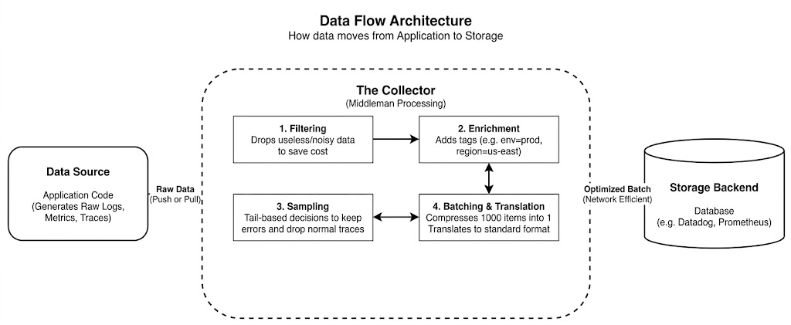

### Diagram 2: Collection Models and Layers

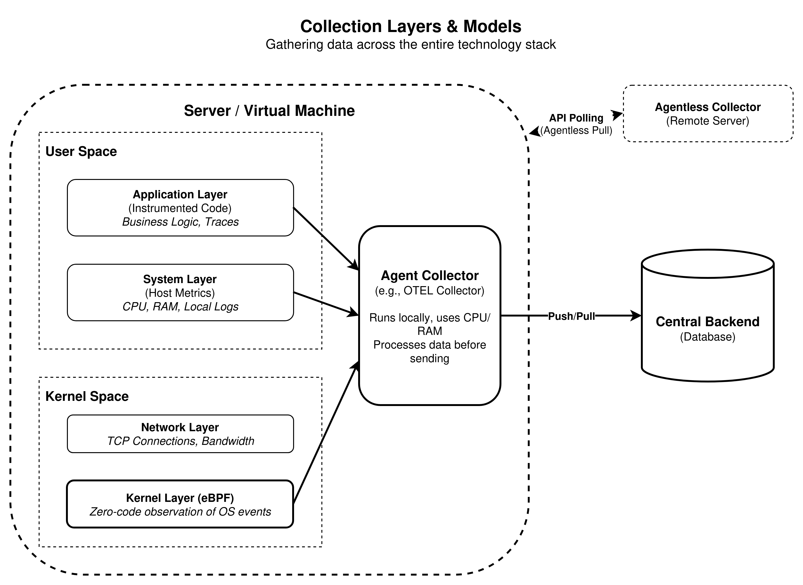

---

## 3. Query Optimization and Execution

### Introduction to Time-Series Querying

In observability systems, collecting data is only the first half of the equation. The second half is extracting meaningful information from that massive pool of data. Time-series databases utilize specialized query languages to achieve this. The most prominent of these languages is PromQL (Prometheus Query Language). Understanding how to construct efficient queries, and understanding how the database engine executes those queries, is critical for maintaining a stable monitoring environment. 

---

### PromQL Deep Dive

PromQL is a functional query language designed specifically for time-series data. It evaluates expressions and returns results in real-time. 

**Basic Data Structures: Instant Vectors vs. Range Vectors**
* An **instant vector** represents a single point in time for each time series. When queried, the database engine returns the most recent value recorded for the matching labels.
* A **range vector** represents an array of values over a specified duration of time for each time series (e.g., all values recorded over the last 5 minutes). Range vectors are required to calculate how a metric has changed over time.

**PromQL Query Analysis (Queries 1 to 3)**

* **Query 1: The Instant Vector Lookup** (`http_requests_total{service="payment", status="500"}`)
  This query searches the index for specific labels and returns the single most recent number. It is extremely fast because it requires minimal disk reading.

* **Query 2: The Range Vector Selection** (`http_requests_total{service="payment", status="500"}[5m]`)
  The addition of `[5m]` turns this into a range vector. It returns every single data point recorded in the last five minutes. 

* **Query 3: Calculating Rate of Change** (`rate(http_requests_total{service="payment", status="500"}[5m])`)
  The `rate()` function takes the array of values from the range vector, accounts for system restarts, and calculates the average per-second increase. The output is an instant vector that can be graphed.

**Aggregations: Sum, Avg, Increase**

* **Query 4: Aggregating with Sum** (`sum by (service) (rate(http_requests_total[5m]))`)
  This calculates the per-second error rate for every instance of every service, then groups the results by service to produce one consolidated line.

* **Query 5: Calculating Total Volume with Increase** (`increase(http_requests_total{service="login"}[1h])`)
  While `rate()` calculates an average, `increase()` calculates the total absolute number of events that occurred during the requested time window.

**Advanced Functions: Histograms and Predictions**

* **Query 6: Calculating Percentiles** (`histogram_quantile(0.95, sum by (le) (rate(http_request_duration_seconds_bucket[5m])))`)
  This calculates the 95th percentile response time. The query looks at data grouped into pre-defined buckets, calculates fill rates, sums them, and runs a mathematical estimation to find the 95% boundary.

* **Query 7: Forecasting with Predict Linear** (`predict_linear(node_filesystem_free_bytes{mountpoint="/"}[1h], 4 * 3600)`)
  Used for capacity planning, this query takes data from the last hour, plots a linear regression line, and projects where that line will be in four hours.

**Subqueries and Complex Expressions**

* **Query 8: The Subquery** (`max_over_time(rate(http_requests_total[5m])[1h:1m])`)
  A subquery evaluates an inner query (the 5-minute error rate) at regular intervals (every 1 minute for the past hour). The outer query (`max_over_time`) returns the absolute highest peak rate observed during that hour.

---

### Query Planning and Execution

The execution of a query follows a strict pipeline: Parsing, Planning, and Execution.

1.  **Parsing:** The system reads the raw text string and converts it into an Abstract Syntax Tree (AST), breaking the query down into mathematical operations and data selectors.
2.  **Planning:** The Planner evaluates the AST to determine what raw data needs to be loaded from the disk based on the requested time range and step size.
3.  **Execution:** The execution engine fetches the raw data from the storage engine, feeds it into the innermost functions, passes those results to the next layer, and returns the computed output.

**Impact of Time Range and Step Size**
The time range determines how much physical data must be loaded from the disk, dictating disk input/output (I/O). The step size determines how many times the mathematical functions must be executed, heavily dictating CPU usage.

---

### Query Performance and Bottlenecks

A poorly written query can cause the entire database server to run out of memory and crash.

**High Cardinality**
Cardinality refers to the number of unique time series in the database. If millions of unique series are created (e.g., by logging user IDs), a query attempting to aggregate them forces the database to load millions of individual files into memory simultaneously, leading to Out-Of-Memory crashes.

**Long Time Ranges**
Querying data over a six-month period requires the database engine to locate, open, and scan hundreds of individual blocks. This process saturates the server's disk reading speed and causes massive latency.

**Complex Aggregations and Regex Matchers**
Regex (Regular Expression) matchers force the database to bypass fast index lookups. It must scan through a massive list of every single label and run a text-matching algorithm to see if it fits the pattern, consuming heavy CPU cycles before the system has even started fetching actual data.

---

### Optimization Techniques

To ensure fast dashboard load times, engineers must actively optimize queries.

**Using Precise Matchers**
Queries should use exact string matching instead of regular expressions whenever possible. Queries should also always include the most restrictive label possible (e.g., `cluster="production"`) to cut out irrelevant data early.

**Pre-Aggregation and Recording Rules**
A Recording Rule is a background process within the database. An engineer configures a complex, slow query as a rule. The engine runs this query automatically in the background (e.g., every minute) and saves the result as a brand-new, simple metric. Dashboards then query this new metric, returning results instantly.

**Downsampling and Retention**
Downsampling is the process of reducing the resolution of historical data to save disk space. High-resolution data (e.g., 15-second intervals) is kept for recent troubleshooting. After a set period, it is downsampled to lower resolution (e.g., 1-hour averages). Retention policies dictate exactly when this data is permanently deleted from the disks.

**Caching Strategies**
Query Result Caching places a proxy layer in front of the database. When a query is received, the cache serves recently calculated results instantly. Metadata caching stores the inverted index in RAM, dramatically speeding up the planning phase of query execution.

---

## 4. Storage Tiers: Hot, Warm, Cold

### Introduction to Data Tiering

If an organization wants to keep its data for a whole year to analyze long-term trends, storing all of it on the fastest, most expensive hard drives is financially impractical. Conversely, storing everything on cheap, slow hard drives makes active monitoring impossible due to latency.

Databases use **Storage Tiering** to solve this. Tiering divides storage into different categories based on speed and cost. As data ages, the database automatically moves it to slower, cheaper storage to save money, keeping newest data on the fastest storage for immediate troubleshooting.

---

### Why Multiple Tiers?

**The Cost Factor: SSD/NVMe vs. Object Storage**
* **NVMe and SSDs:** High-performance, low-latency, but very expensive to maintain at scale.
* **HDDs:** Use physical spinning magnetic platters. Slower, but much cheaper to produce in massive sizes.
* **Object Storage (S3, GCS):** Massive, distributed pools of cheap storage managed over a network. Incredibly cheap, but accessing data requires network requests, making it the slowest option.

**The Access Pattern Factor**
Observability data value decays rapidly over time. Data from the last five minutes is queried hundreds of times during an outage. Data that is six months old is almost never accessed, except for compliance or annual reporting. Tiering aligns hardware cost with human access patterns.

---

### The Three Storage Tiers

**Hot Storage**
* **Time Range:** Present moment back to 7–30 days.
* **Hardware:** Enterprise-grade NVMe or high-speed SSD drives.
* **Characteristics:** Supports massive simultaneous writes and reads. Data is often kept uncompressed or lightly compressed in RAM to ensure queries execute in milliseconds.

**Warm Storage**
* **Time Range:** 30 days to 90 days.
* **Hardware:** Cheaper SSDs or traditional spinning HDDs.
* **Characteristics:** Data is highly compressed on disk. When queried, the database must reach out to the physical disk, read the compressed block, and decompress it. Queries take seconds.

**Cold Storage**
* **Time Range:** 90 days out to several years.
* **Hardware:** Object Storage (Amazon S3, Google Cloud Storage).
* **Characteristics:** Operates over a network. To run a query, the database makes API calls to download large compressed blocks over the network, decompress them locally, and process them. Queries can take minutes.

---

### Data Movement and Lifecycle

**Automated Policies (Information Lifecycle Management)**
Modern systems use background processes to manage data automatically. An administrator writes rules (e.g., compress and move data to Warm storage after 7 days, upload to S3 after 30 days, permanently delete after 365 days). The database seamlessly executes these moves without disrupting incoming data.

**Query Federation**
When a user asks for data covering the last 60 days, part of it lives in Hot, part in Warm. A central component called a Query Router splits the query automatically. It asks the Hot tier for days 0-7, the Warm tier for days 8-60, stitches the numbers together into one continuous timeline, and returns the final graph to the user.

---

### Cost-Performance Trade-offs

Every architectural decision is a trade-off between query speed and financial cost.

**Cost Analysis Example: Storing 1 Terabyte for 1 Year**
* **All Hot Storage (Premium SSD):** Assuming $0.10 per GB/month, storing 1000 GB costs $100.00 per month, totaling **$1,200.00 per year.**
* **All Cold Storage (Amazon S3 Standard):** Assuming $0.023 per GB/month, storing 1000 GB costs $23.00 per month, totaling **$276.00 per year.**

At the enterprise scale of 2 Petabytes (2,000 TB), Hot storage costs $2,400,000 annually, while Cold storage costs $552,000. By keeping only 5% of data in Hot storage and pushing 95% to Cold, a company can save millions annually while keeping active dashboards lightning fast. 

**The Latency Impact**
The trade-off is query latency. Hot tier latency is measured in milliseconds, Warm in seconds, and Cold in tens of seconds or minutes. Policies must be designed carefully so that active troubleshooting never hits the Cold tier.

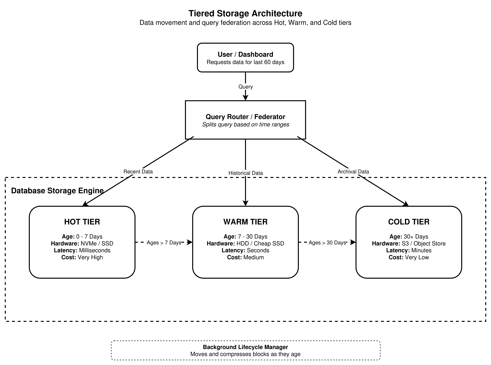

---

## 5. Practical Analysis

Complete the Prometheus setup on docker and ran high cardinality script with Python. Here are some screenshots from the Prometheus queries.

### Level 1: Basics and Instant Vectors

**1. The Health Check (Simplest Query)**
```promql
up
```

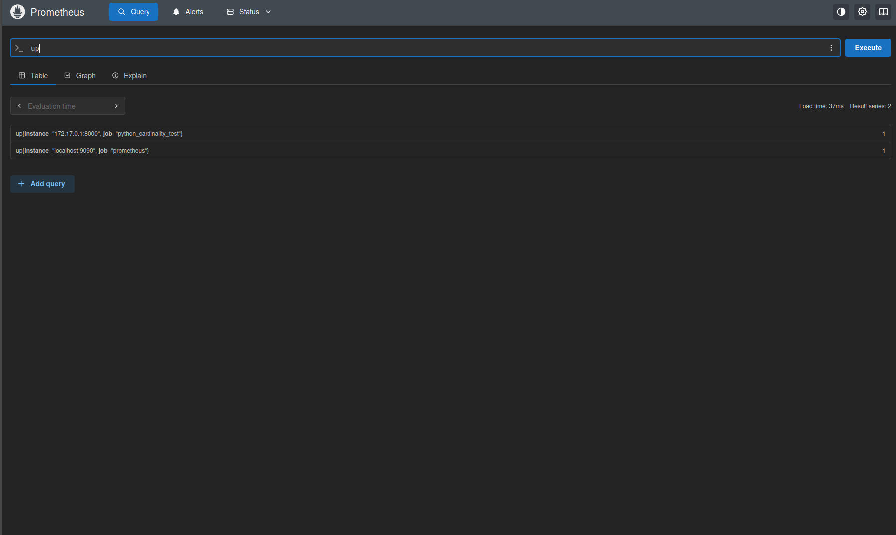

* **Concept:** This is the most fundamental query. It checks the status of all configured scrape targets.
* **Result:** Returns `1` if the target is healthy and currently being scraped, and `0` if it is down or unreachable.

**2. Basic Metric Lookup with Label Filtering**
```promql
dummy_api_requests_total{status="500"}
```

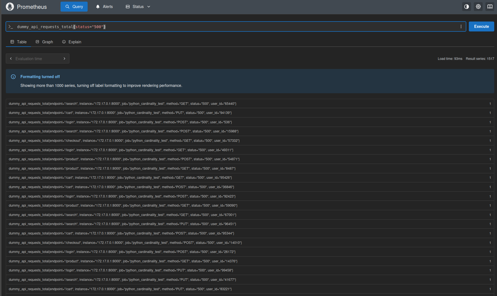

* **Concept:** Retrieves the current, total value of a specific metric but filters the massive dataset down using an exact label match.
* **Result:** Returns the absolute number of requests that resulted in a 500 Server Error for every unique user ID that generated one.

**3. Negative Filtering and Regex**
```promql
dummy_api_requests_total{endpoint!="/health", method=~"POST|PUT"}
```

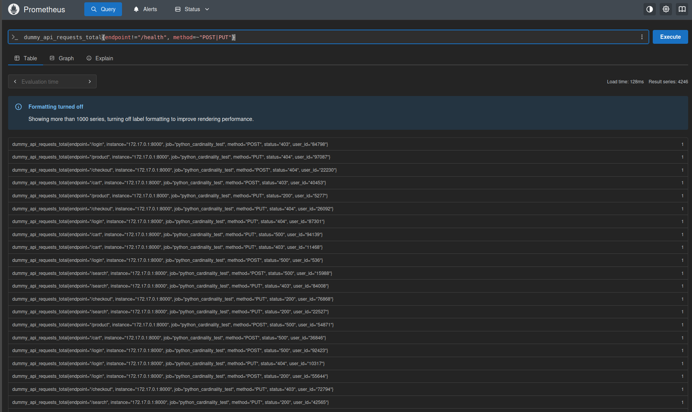

* **Concept:** Uses a negative matcher (`!=`) to ignore health checks, and a regular expression (`=~`) to look for multiple types of data modification requests simultaneously.
* **Result:** The absolute count of POST or PUT requests to any endpoint *except* `/health`.

---

### Level 2: Range Vectors and Rates

**4. The Rate of Change (The standard graphing query)**
```promql
rate(dummy_api_requests_total[5m])
```

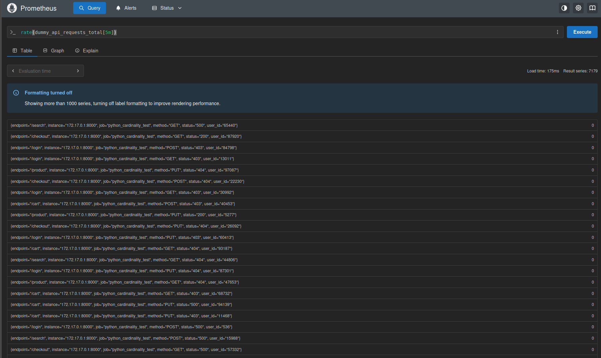

* **Concept:** You cannot graph a raw, ever-increasing counter effectively. The `rate()` function takes a 5-minute range vector (an array of data points) and calculates the average per-second increase, handling counter resets automatically.
* **Result:** A per-second value that can be cleanly drawn on a line graph.

**5. Total Increase Over Time**
```promql
increase(dummy_api_requests_total{status="200"}[1h])
```

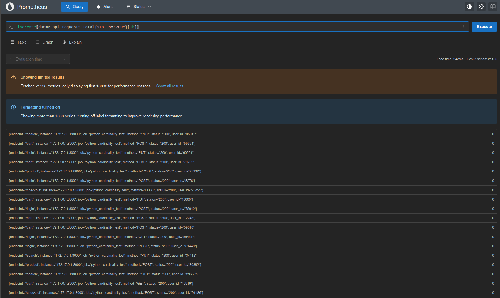

* **Concept:** Instead of a per-second average, `increase()` calculates the total absolute number of events that happened during a specific time window.
* **Result:** The exact total number of successful (200 OK) API requests processed in the last 60 minutes.

---

### Level 3: Simple Aggregations

**6. Grouping by Labels**
```promql
sum by (method) (rate(dummy_api_requests_total[5m]))
```

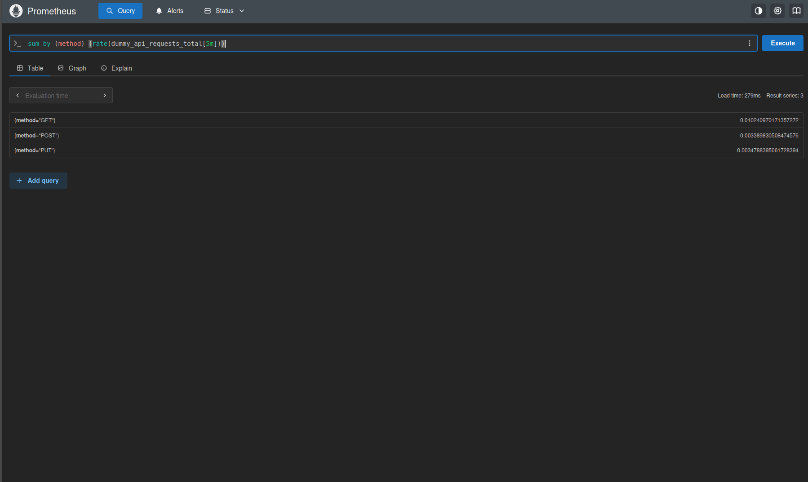

* **Concept:** Your script generates tens of thousands of individual lines (one for each user). This query calculates the rate for all of them, but then uses `sum by (method)` to squish those thousands of lines down into just three lines representing the total rate for GET, POST, and PUT requests.
* **Result:** Three aggregated lines showing overall system traffic by HTTP method.

**7. Excluding Labels (The `without` operator)**
```promql
avg without (user_id) (rate(dummy_api_requests_total[5m]))
```

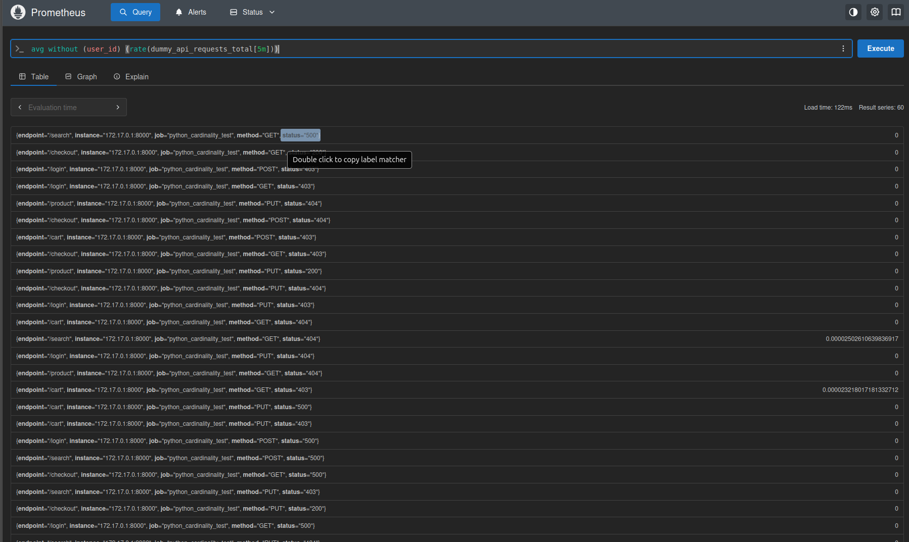

* **Concept:** Instead of specifying what to group *by*, you specify what to throw away. This throws away the high-cardinality `user_id` label and calculates the average rate across all remaining label combinations (method, endpoint, status).
* **Result:** Averages out the traffic, removing the noise of individual users.

---

### Level 4: Advanced Logic and Joins

**8. Multi-Level Aggregations (Calculating Percentages)**
```promql
sum by (endpoint) (rate(dummy_api_requests_total{status=~"5.*"}[5m]))
/
sum by (endpoint) (rate(dummy_api_requests_total[5m]))
* 100
```

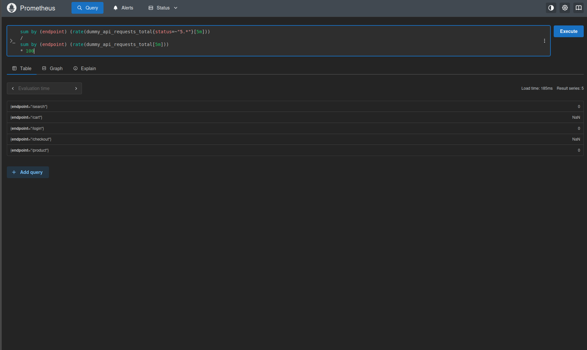

* **Concept:** This uses two separate aggregated queries and does math between them. It takes the rate of 5xx errors per endpoint, divides it by the total rate of all requests per endpoint, and multiplies by 100 to get a percentage.
* **Result:** A clean graph showing the real-time Error Rate Percentage for every endpoint.

---

### Practical Analysis: Performance and Storage (Simplified)

#### 1. Analyze Query Performance

* **Query Execution Time:** Simple data lookups are extremely fast. However, complex queries that combine thousands of distinct data points into a few summary lines force the CPU to work much harder, significantly increasing dashboard load times.
* **Impact of Time Range:** Querying longer time periods forces the database to scan more data. Fetching old, historical data from the physical hard drive is much slower than grabbing recent data from the active memory (RAM).
* **Impact of Cardinality:** Creating too many unique labels (like tracking individual random user IDs) overwhelms the entire system. It strains the user interface and causes the "Sparse Data Trap," where metrics completely vanish because mathematical functions like `rate()` require at least two data points per user to calculate a trend.

#### 2. Storage Analysis

* **Prometheus Data Directory Size:** High cardinality rapidly consumes hard drive space. Because every unique label combination forces the database to create a brand-new time-series file, storage needs multiply instantly instead of growing slowly over time.

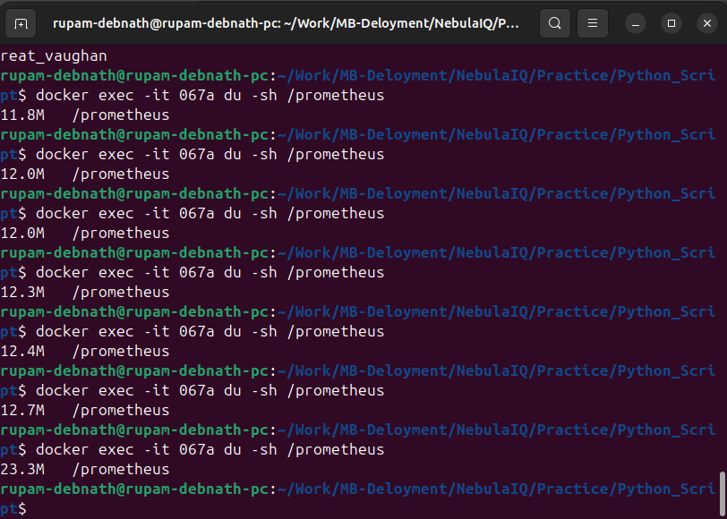

* **Understanding Block Structure:** Incoming data sits in fast RAM (Head Block) and is simultaneously backed up to a crash-log file (WAL). Every two hours, this data is bundled into permanent "Blocks" on the disk, which contain a searchable index and the actual compressed numbers.
* **Compression Ratios:** Prometheus is normally excellent at shrinking numerical data to save space. However, high cardinality ruins this efficiency because the system must maintain a massive text-based index to track all the unique labels, which cannot be easily compressed.