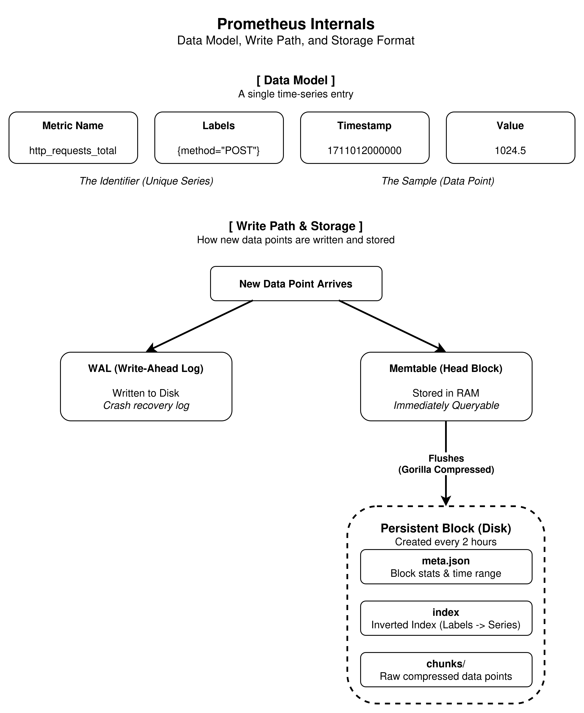
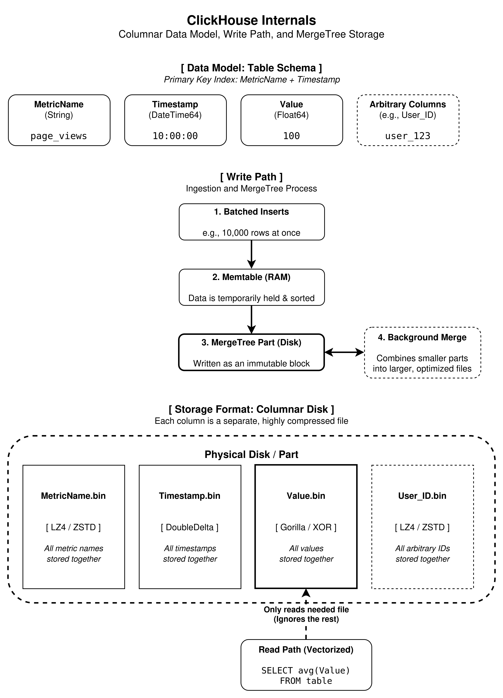

# Time-Series Data Storage & Query Optimization

## 1. Time-Series Database Internals

This section explores how specialized databases handle the massive influx of timestamped data. The focus is on **Prometheus**, the industry standard for metrics monitoring, and **ClickHouse**, a powerful columnar database often utilized for large-scale analytics.

---

## 1.A Prometheus

### Data Model: How is time-series data structured?
Prometheus organizes data as a continuous stream of numerical values. Each entry consists of four distinct components:
* **Metric Name:** Identifies the feature being measured (e.g., `http_requests_total`).
* **Labels:** Key-value pairs utilized to filter and categorize data (e.g., `method="POST"` or `service="order-service"`).
* **Timestamp:** A 64-bit integer representing the exact millisecond the data point was recorded.
* **Value:** A 64-bit float (decimal number) representing the actual measurement.

### Label-based indexing
Prometheus utilizes an **Inverted Index**. Similar to a book index mapping keywords to page numbers, this structure maps specific labels to a list of associated Series IDs. This mechanism allows the system to locate specific data across millions of series instantly without scanning every file on the disk.

### Storage Format: How is data organized on disk?
Prometheus persists data in **Blocks**. At two-hour intervals, data residing in memory is written to a specific directory on the disk. This directory contains:
* **Chunks folder:** Stores the actual raw, compressed numerical data.
* **Index file:** Maps the labels to the corresponding chunks.
* **Meta.json:** Contains metadata describing the block, such as the start and end time of the contained data.

### Chunk-based storage (Prometheus blocks)
A "Chunk" is a compressed grouping containing approximately 120 data points for a specific metric. By grouping these points together, disk seek times are minimized, allowing the system to read a long history of a given metric sequentially.

### Compression: Time-series compression algorithms
Prometheus implements **Gorilla** compression to minimize its data footprint:
* **Delta-of-Delta:** Because metrics are typically collected at steady intervals (e.g., every 15 seconds), the system stores only the difference between intervals. If the timing remains perfectly steady, the "difference of the difference" is zero, consuming almost no storage space.
* **XOR Compression:** For numeric values, the current number is compared to the previous one using an XOR bitwise operation. If the numbers are highly similar, only the small variance is stored.

### Why is compression crucial? / Compression ratios achieved
Monitoring systems generate substantial data volumes. Compression is critical to prevent rapid disk exhaustion. Prometheus can compress 16 bytes of raw data to approximately **1.37 bytes**, achieving a **12x reduction**, which facilitates the storage of extensive historical data on standard disk drives.

### Write Path: How are new data points written?
1.  **WAL (Write-Ahead Log):** Data is immediately written to a crash-log file on disk, ensuring durability and preventing data loss in the event of a system failure.
2.  **Memtable (Head Block):** Concurrently, the data is stored in RAM, making it immediately available for querying.
3.  **Flushing:** At two-hour intervals, the RAM data is bundled, compressed, and flushed to persistent disk blocks.

### Read Path: How are queries executed?
1.  **Index Lookup:** The Inverted Index is queried to find Series IDs matching the requested labels.
2.  **Data Retrieval:** Compressed chunks are pulled from RAM (for recent data) and Disk (for historical data).
3.  **Aggregation:** Final computations (such as sums or averages) are performed, and the results are returned to the client.

---

## 1.B ClickHouse

### Data Model: How is time-series data structured?
ClickHouse is a high-performance, table-based database utilizing standard SQL. For time-series applications, tables typically include columns such as `MetricName`, `Timestamp`, and `Value`. Unlike Prometheus, the schema allows for the addition of arbitrary columns (e.g., `User_ID` or `City`), offering greater flexibility for complex datasets.

### Label-based indexing
ClickHouse employs a **Primary Key Index**, sorting data on the disk typically by `MetricName` and then `Timestamp`. During a search, the system identifies the exact physical location of the sorted data section, bypassing the need to scan irrelevant records.

### Storage Format: How is data organized on disk?
ClickHouse operates as a **Columnar** database. Unlike row-oriented databases where all data for a single row is stored contiguously, individual columns (e.g., Timestamps, Values) are stored in separate files. This architecture significantly enhances query performance; queries requesting only specific values will solely access the relevant column file, ignoring the rest.

### Compression: Time-series compression algorithms
Storing similar data adjacently in columns yields massive compression capabilities. ClickHouse utilizes:
* **LZ4 / ZSTD:** Standard compression algorithms used to shrink files.
* **DoubleDelta:** Stores the difference between timestamps, similar to the Prometheus methodology.
* **Gorilla:** Implements the same XOR mathematical operations used by Prometheus to compress numeric values.

### Why is compression crucial? / Compression ratios achieved
Designed for petabyte-scale workloads, ClickHouse relies on compression to accelerate query execution by reducing physical disk I/O. Depending on data uniformity, compression ratios of **10x to 30x** are frequently achieved.

### Write Path: How are new data points written?
1.  **Insert:** Data is ingested in large batches (e.g., 10,000 rows simultaneously).
2.  **Memtable:** Data is temporarily held in memory, sorted, and prepared.
3.  **MergeTree:** Data is written to the disk as a "Part."
4.  **Background Merge:** Background processes continuously combine smaller Parts into larger, highly optimized files over time.

### Read Path: How are queries executed?
1.  **Column Selection:** The system reads only the files corresponding to the queried columns.
2.  **Parallel Execution:** Multi-core processing is utilized to scan different data segments concurrently.
3.  **Vectorized Execution:** Data is processed in large arrays utilizing SIMD instructions, executing mathematical operations across thousands of rows simultaneously.

---

## 1.C Comparative Analysis

### When to use which TSDB?
* **Prometheus** is optimal for real-time infrastructure and application monitoring. It provides straightforward deployment and serves as the native choice for Kubernetes environments.
* **ClickHouse** is preferred for environments with high cardinality (billions of unique label combinations) or for the unified storage of metrics, logs, and traces intended for deep analytical processing.

### Trade-offs: query flexibility vs performance vs cost
* **Prometheus:** Provides rapid querying for recent data via PromQL but incurs high memory costs for long-term historical data retention.
* **ClickHouse:** Offers cost-effective, long-term disk storage and standard SQL support, though it requires more complex configuration and maintenance compared to the operational simplicity of Prometheus.

---

## 1.D Storage Examples

Consider the tracking of a website counter: `page_views{page="/home"} 100`.

1.  **Prometheus Storage:**
    * The system queries the index for the `/home` label and maps it to a specific Series ID (e.g., `Series ID: 10`).
    * The system targets the specific chunk file associated with `ID: 10`.
    * The timestamp is stored using **Delta-of-Delta** compression, and the value `100` is stored using **XOR** compression.
    * This entry is maintained in a temporary 2-hour memory block before being flushed to disk.

2.  **ClickHouse Storage:**
    * The entire record is processed as a row: `('page_views', '/home', '10:00:00', 100)`.
    * The string `'page_views'` is written to the **MetricName file**.
    * The integer `100` is written to the **Value file**.
    * The system compresses the `100` alongside values from other records within that column, identifying patterns to optimize storage space.